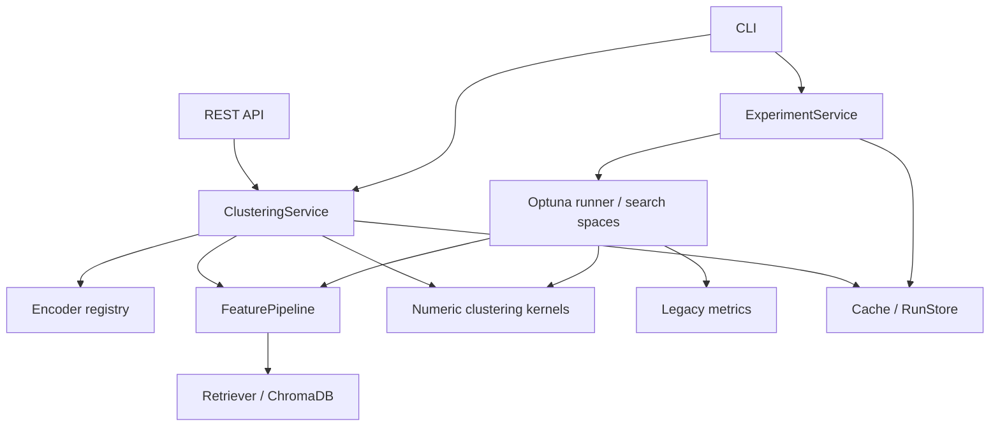

# 总体重构方案

## 目标与非目标

建立可安装、可测试、可复用的 Python 包，同时提供按固定 profile 的同步小批量 API。十种现有实验算法继续开放，MeanShift 为 CLI-only。数据准备、知识库构建、调参和全量运行属于 CLI。

本轮不引入自动语义净化、不重标注、不改变数据切分、不修正 CW/PCA 等结果相关缺陷，不构造不存在的持续分类预测模型，不增加多用户、任务队列或业务数据库。

## 依赖边界

聚类只处理矩阵和参数。特征只处理向量和检索，不读取标签。搜索只建议参数、运行 objective、记录结果。Service 负责调用顺序，API 负责协议、校验、并发准入和异常映射。外部实现通过两个 Protocol（Encoder/Retriever）替换，算法注册是显式字典。

## 不改变结果的措施

1. 输入顺序、原始字符串、重复记录、类别映射全部保留。
2. 不统一改成 float32，不新增 L2 normalization，不切换 pooling 或 tokenizer。
3. 每个样本使用独立 np.mean，保持历史算术路径；不默认以 top-7 前缀替代所有 k 查询。
4. 独立保留 legacy-radbscan-v1 的额外降维；普通 legacy-v1 保留两路单独拟合降维的历史行为。
5. 从旧类提取搜索函数，保留 suggest 调用顺序、名称、范围和条件；固定推理必须有完整解析配置。
6. 后端固定 Python。C 扩展缺失时明确报错，不自动选择另一个实现。
7. 新产物写 artifacts；旧目录不写入、不自动清洗或重建。
8. 随机算法在测试中注入相同随机状态，但不悄悄给生产兼容版本新增 seed。

## 版本与基线

- `legacy-v1`：当前计算语义，包含已知缺陷。
- `current-environment`：本机冻结的合成测试输入及依赖，不代表论文历史向量。
- 论文/历史结果：保留来源目录、原始参数和文件 SHA-256。现有二十个 profiles 均从 output_bge_large 导出，source_sha256 可追溯。
- 后续修复必须增加新实现或特征版本，旧 profile 不变。

并行 TPE 的重新搜索不要求产生相同最佳参数；固定参数+固定向量+固定近邻的输出才是结构重构的主要验收依据。

## 实施取舍

保留根目录旧脚本和两个 optimizer 文件作为迁移对照，不立即删掉；旧入口的历史算法缺陷仍可能在显式运行时触发。新运行统一使用 `retrain-cluster`。原始入口快照位于 legacy/*.py.txt，凭证已脱敏，原始文件哈希保存在基线清单。

数据类用于内部样本/向量/特征/profile 边界；运行清单使用版本化 JSON，API 使用 Pydantic，避免同时维护三套同义对象。
