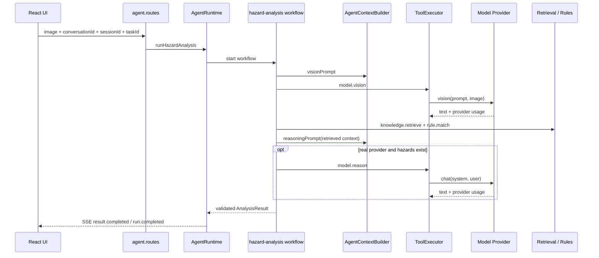
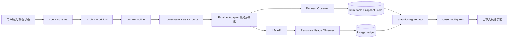
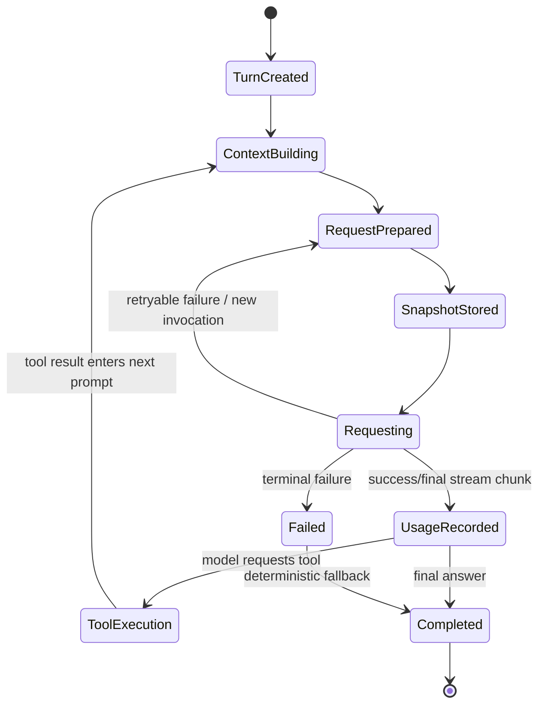

# Agent 上下文 Token 可观测系统设计

> 状态：实施基线（2026-08-24）  
> 范围：当前核电隐患图片分析 Agent Runtime 及其 `Token 统计` 页面  
> 原则：所有结论来自仓库代码；实际 Token 只信任 Provider usage；估算值始终以 `≈` 展示。

## 1. 当前系统审计（实施前基线）

### 1.1 当前 Agent Runtime 调用链

当前入口是 `POST /api/agent/runs/stream`。一次图片上传创建一个 Run，并顺序执行：



业务 Workflow 已显式拆成 preflight、vision、retrieval、rules、context、reasoning、validation、assemble。此结构合理，应保留。确定性检索、规则与输出校验不应改造成由模型自行决定是否执行。

### 1.2 Session / Conversation / Turn / Step 现状

- `AgentRunIds` 已有 user、conversation、session、task、run、trace、analysis ID。
- 当前没有 `agentId`、父子 Agent、Turn 实体或 `turnIndex`。
- 当前 `stepId` 表示 Workflow 节点，不表示真实 LLM 请求。一个 Workflow step 内理论上可发生多次 Provider retry。
- 当前产品一次图片提交就是一次用户交互，因此迁移后可将每个 Run 映射为当前 master Agent 的一个 Turn；同一 Run 内所有 LLM 请求属于同一 Turn。
- `TokenUsageStore` 的 Call 接近 LLM Step，但创建点在 `ToolExecutor tool.started`，仍高于 Provider request boundary。

### 1.3 LLM Provider 调用入口

- 视觉调用：`hazard-analysis.ts -> provider.vision()`。
- 推理调用：`hazard-analysis.ts -> provider.chat()`。
- 最终 OpenAI-compatible payload 在 `server/providers/openai-compatible.ts` 的 `vision/chat` 中构造，`complete()` 发出 HTTP 请求。
- `complete()` 自带 retry；当前多次真实 HTTP request 被折叠为一个 `ModelCallResult.attempts`，不满足“一次真实请求一个 Step”。
- Mock Provider 是演示来源，不是计费 usage；必须显式标记为 `mock_provider`。

### 1.4 Provider usage 数据格式

`normalizeOpenAICompatibleUsage()` 已把 `prompt_tokens`、`completion_tokens`、`total_tokens` 与 `prompt_tokens_details.cached_tokens` 归一化，并保证 cached 是 input 子集。这一语义必须复用。现状缺少 cache-write、原始 usage、单 retry request ID、cost 与 context-window。

### 1.5 Context Builder 位置

- 视觉静态 prompt：`AgentContextBuilder.visionPrompt()`。
- 推理 system + user prompt：`AgentContextBuilder.reasoningPrompt()`。
- 推理 user prompt 含视觉候选、法规标准、历史案例和规则；它们来自 Runtime 注入，不是真实用户消息。
- 当前 `estimateTokens()` 是中文字符启发式，仅用于裁剪预算。它不能冒充 Provider actual usage。
- Builder 会按 evidence 优先级丢弃 case/standard/rule，但只返回 `dropped`，没有 PruneEvent、稳定 item ID 或历史快照。

### 1.6 Tools serialization 位置

当前模型请求没有传 `tools/functions`，所以 Tool Definition 的真实统计应为 0，而不是把 `ToolExecutor` 注册项伪装成模型工具。`knowledge.retrieve` 和规则匹配是后端确定性节点，其结果经 Builder 组织后作为 `injected_content` 进入推理 prompt。未来启用原生 tool calling 时，必须从 Provider 最终 serialized `tools` 数组逐工具捕获完整 schema。

### 1.7 Subagent / fork 机制

当前仓库没有 subagent 或 fork。新数据模型预留 `AgentBranch(parentAgentId, forkStepId)` 和独立 timeline，但当前运行只创建 `master`。UI 在只有 master 时不伪造子 Agent；将来 fork 时无须改变统计模型。

### 1.8 Compression / pruning 机制

当前没有 history compaction/compression。`reasoningPrompt()` 的 evidence budget 裁剪属于显式 pruning，应记录移除来源与估算 Token；不能记为 compression。顶部 compression 当前应显示 0。未来摘要替换历史 items 时才记录 CompressionEvent。

### 1.9 当前缺失的数据

1. 每个 Provider HTTP request 对应的 LLM Step 与 invocation ID。
2. 请求发出前、基于最终 payload 的不可变 Context Snapshot。
3. 六类 Context Item、稳定 ID、content hash、来源归属和 item 级估算。
4. Agent/Turn timeline、同 Agent previous-Step diff。
5. context window、图片输入归属、compression/pruning 事件。
6. usage raw、cache write 与按配置计算的 cost。
7. Context Browser、Step/Turn 历史趋势和 raw/Markdown 明细。
8. 进程重启后的持久化。当前所有 trace/usage 都是有界内存；本次保持部署形态兼容，提供可替换 Store 接口与 Session Log 导出，生产迁移到 append-only 数据库。

### 1.10 Telemetry Hook 建议位置

```text
Context Builder
  -> 带来源的 ContextItemDraft
Provider Adapter 构造最终 payload
  -> Request Observer（每个 retry attempt 之前）
     -> 创建 LLMStep + immutable ContextSnapshot
HTTP response / final stream usage
  -> Response Usage Observer（按 invocationId 幂等）
     -> 回填 actual usage / latency / requestId / cost
Statistics Store
  -> API -> React Context UI
```

`ToolExecutor` 继续负责业务工具 trace，但不再作为 LLM Step 的权威创建点。Provider observer 才能正确区分 retry 与重复完成回调。

## 2. 架构问题与替代方案

| 当前问题 | 造成的结果 | 推荐替代方案 |
| --- | --- | --- |
| Workflow step、Tool call、LLM call 概念混用 | retry 和真实请求数量不可追溯 | Provider boundary 每个 request 创建 LLMStep；保留 workflowStepId 关联 |
| 完成后才从 tool event 记 usage | 无请求前快照 | Request Observer 先 append snapshot，Response Observer 幂等回填 ledger |
| prompt 是两个大字符串 | 无法回答占用来自哪条检索结果 | Builder 同时输出 payload 文本与带来源的 item drafts |
| 估算只在 Builder 总量级 | 无分类、item、diff | model + serializedContentHash memoized estimator |
| 当前 Token UI 只有累计 API usage | 把消费与当前上下文混在一个心智模型 | 页面同时展示 Context State 与 Usage Ledger，并清晰标注口径 |
| evidence drop 未成为事件 | 趋势下降原因不可解释 | 记录 PruneEvent，关联 next LLM Step |
| 无 context-window/pricing 配置 | 百分比和费用只能猜 | Provider/model metadata 配置；未知显示 `--` |

## 3. 新总体架构



两个核心事实模型严格分离：

- **Context State / Snapshot**：某 Agent 某 Step 发请求时，模型可观察输入由什么组成。
- **Usage Ledger**：每次实际 Provider 请求消耗了多少 input/output/cache、耗时与费用。

## 4. 数据结构

### 4.1 层级标识

```ts
interface AgentBranch {
  agentId: string; sessionId: string; name: string;
  parentAgentId?: string; forkStepId?: string; createdAt: string;
}
interface AgentTurn {
  turnId: string; sessionId: string; agentId: string;
  runId: string; turnIndex: number; startedAt: string; completedAt?: string;
}
```

当前每个 Run 注册 `agentId = master` 和一个 Turn。未来子 Agent fork 后自行递增 Turn/Step，不与 master 相加当前上下文。

### 4.2 Context Item / Snapshot

```ts
type ContextCategory =
  | 'system' | 'tool_definition' | 'user_message'
  | 'injected_content' | 'assistant_message' | 'tool_result';

interface ContextItem {
  id: string; category: ContextCategory; label: string;
  sourceType: string; sourceId?: string;
  contentHash: string; content?: unknown;
  estimatedTokens: number; estimateMethod: 'tokenizer' | 'heuristic' | 'unknown';
  turnIndex?: number; toolName?: string; toolCallId?: string;
}

interface ContextSnapshot {
  snapshotId: string; stepId: string; items: ContextItem[];
  categories: Record<ContextCategory, CategoryStats>;
  estimatedPromptTokens: number;
  actualPromptTokens?: number; completionTokens?: number;
  cacheReadTokens?: number; cacheWriteTokens?: number;
  contextWindow?: number; imageCount: number;
}
```

Item ID 由语义来源生成（prompt version、message ID、retrieval record key、toolCallId 等）；content hash 用于识别 retained item 是否 modified。Snapshot append 后 items 不再修改，usage 字段存放在 Step/Ledger 并在读模型中合并，防止未来 Context 污染历史。

### 4.3 LLMStep / Usage Ledger

```ts
interface LLMStep {
  stepId: string; invocationId: string; requestId?: string;
  sessionId: string; conversationId: string; runId: string;
  agentId: string; turnId: string; turnIndex: number; stepIndex: number;
  workflowStepId?: string; phase: LLMCallPhase;
  provider: string; model: string; status: 'running'|'completed'|'failed';
  snapshot: ContextSnapshot; startedAt: string; completedAt?: string;
  actualPromptTokens?: number; completionTokens?: number;
  cacheReadTokens?: number; cacheWriteTokens?: number;
  latencyMs?: number; contextWindow?: number; usageRaw?: unknown;
}
```

Ledger 以 `invocationId` 唯一约束。重复 response callback 只更新同一条；真实 retry 使用新 invocationId 和新 Step。无 usage 时 actual 保持 `undefined`，UI 显示 `--`。

### 4.4 Diff 与事件

同一 Agent 按请求时间找到 previous Step，以 item ID 做 added/removed/intersection，再以 contentHash 判断 modified。每类预计算 item/token delta。CompressionEvent 和 PruneEvent 独立；本项目 Builder evidence drop 只产生 PruneEvent。

## 5. 完整执行流程与状态机



| 状态/节点 | 输入 | 输出 | retry/fallback |
| --- | --- | --- | --- |
| ContextBuilding | runtime state、retrieval、rules、history | prompt + item drafts + prune events | 超预算按确定策略剪枝 |
| RequestPrepared | Provider 最终 messages/tools | invocation、serialized request metadata | 每次 retry 重新进入 |
| SnapshotStored | drafts + final payload | immutable snapshot + running Step | 写失败则阻止请求，避免无 trace 调用 |
| Requesting | HTTP request | provider response/error | retry 产生新 Step；不覆盖旧 Step |
| UsageRecorded | normalized provider usage | idempotent ledger entry | 重复 callback ignored |
| OutputValidation | model text | domain result | 无效则确定性 fallback/review |

## 6. Context 构建、缓存与裁剪

- 静态 prompt cache 继续复用 `VersionedTtlCache`。
- 新 TokenEstimator cache key 为 `model + serializedContentHash`；只缓存估算结果。
- system、tool schema、user、runtime injection、assistant history、tool result 分层构造，只有最终 request 中存在的 item 才进入 Snapshot。
- Provider actual prompt 不按比例反推到分类；分类百分比始终使用 estimated category total。
- 当前 workflow 无 assistant history/tool result 重入，相关类别真实显示 0。
- 当前 context 使用率为 latest selected Agent Step 的 actual prompt（缺失才 fallback estimated）除以 context window；completion 不进入分子。
- context window 未配置时显示 `--`，不得从模型名猜测。

## 7. Memory / History / RAG / Rules

- 当前 SessionMemoryStore 仅保存结构化任务摘要且未注入模型，因此不得统计为当前 Context。
- 长期历史只在未来被检索并实际注入时计入 `injected_content`；conversation/task/user 必须按 ID 隔离。
- standards/cases/rules 是 Runtime 注入，保留具体 record key、检索 query、rank/version 来源。
- 确定性权限、输入格式、bbox、引用白名单、风险 guardrail 和 schema 校验继续留在后端；只把需要模型判断的任务规则放 prompt。
- 冲突优先级：安全/权限硬规则 > 受控业务规则 > 当前用户输入 > memory/RAG > 历史模型输出。模型输出后再次做确定性校验。

## 8. Tool Calling

当前没有原生模型 tools，UI 工具定义为 0。未来 Provider adapter 在最终 payload 中捕获完整 schema；LLM tool_call 本身不创建 Step，下一次真实 LLM request 才创建 Step，tool result 用 toolCallId 作为稳定 item ID。副作用工具继续使用 ToolExecutor 的 sideEffect、timeout、attempt 语义，并要求幂等 key。

## 9. 前后端同步与 Streaming

新增/保留事件：

```text
llm.step.started      request snapshot 已落库
llm.step.completed    actual usage 已回填
llm.step.failed       本次 invocation 失败
context.pruned        显式剪枝
context.compressed    摘要/压缩
```

事件只驱动 UI 刷新，不作为统计事实源。页面通过查询 API 读取 Statistics Model；SSE chunk 不创建 Step。ID 链为 conversation -> session -> run/turn -> agent -> llmStep，并保留 workflowStepId/toolCallId 关联。

## 10. API、页面与性能

建议接口：

```text
GET /api/agent/context-observability?conversationId=&sessionId=
GET /api/agent/context-observability/steps/:stepId
GET /api/agent/context-observability/export?sessionId=
```

Overview 返回 agent/turn/step 摘要、预计算 category/diff/trend/stats，不返回大段 raw content；Step detail 按需返回 item content。页面包含：

1. 上下文统计：轮次、步数、注入、压缩、剪枝、图片、真实 cache hit、预计费用。
2. 当前构成：Agent 切换、model/provider、current/window、六类 stacked bar、Tool Top。
3. 历史趋势：Step/Turn 切换；Turn 使用最后一个有效 Step，不累计上下文高度。
4. Context Browser：Turn/Step selector、estimated/actual/output、分类/items、raw/Markdown 与 previous-Step diff。
5. Usage Ledger：保留现有 Run/Session/Conversation 累计 API usage，明确与当前上下文区分。

长列表采用分页/虚拟化演进；本 Demo 先用有界内存、overview 脱敏/去正文与 detail lazy load。Snapshot 与 Ledger 均 append-oriented，生产持久化建议表：`agent_branch`、`agent_turn`、`llm_step`、`context_snapshot`、`context_item`、`usage_ledger`、`context_event`，`invocation_id` 唯一索引。

## 11. 费用、缓存与降级

- Cache hit = Σ provider cacheRead / Σ provider prompt，仅统计具有真实 usage 且 cache 字段可用的请求；否则 `--`。
- cached input 是 input 子集，费用按 uncached input、cache read、cache write、output 互斥计算。
- pricing/context-window 只读配置，不散落 hardcode；缺配置费用/window 显示 `--`。
- request snapshot 写入失败时不静默发模型请求；response usage 缺失时保留成功 Step、actual `--`。
- observability 查询失败不影响既有分析结果；页面显示可重试错误。
- 原始图片 base64、API key、Authorization 永不写 trace；只保存 mime、hash、数量和可用的 image-token usage。

## 12. Observability / Trace

```text
Conversation
  Run / Turn
    Workflow Step
      LLM Step / invocation
        Context Snapshot
        Model request + provider requestId
        Usage Ledger
      Tool Call / Retrieval
      Prune / Compression Event
```

可按 agent/turn/step/model/provider/phase 查询 input、completion、cache、latency、cost、estimated-actual gap、diff 和 fallback。所有 UI 总数可回溯到单 Step 和单 item。

## 13. 实施与迁移计划

### 新增

- `shared/context-observability.ts`：统一协议与六类配置。
- `server/agent/observability/context-observability-store.ts`：快照、Ledger、diff、统计、幂等。
- `web/components/ContextCharts.tsx`：当前构成与趋势图。
- `web/components/ContextBrowser.tsx`：Step 浏览和 lazy detail。

### 修改

- `server/providers/types.ts`：request/response observer、context drafts、context-window/pricing metadata。
- `server/providers/openai-compatible.ts`、`mock-provider.ts`：最终 payload 边界 hook；每 attempt 独立 invocation。
- `server/agent/context/context-builder.ts`：输出带来源的 items 与 pruning 元数据；token memoization。
- `server/agent/runtime-types.ts`、`runtime.ts`：注册 master/Turn、提供 model telemetry options、关联 workflow step。
- `server/agent/workflows/hazard-analysis.ts`：把真实 Context drafts 传到 Provider。
- `server/http/agent.routes.ts`：overview/detail/export API。
- `web/api/token-usage.ts`、`web/pages/TokenUsage.tsx`、`web/styles.css`：消费 Statistics Model，保留累计 Usage Ledger。
- `server/agent/runtime.test.ts`：覆盖 12 项验收与 API 回归。

### 迁移顺序

1. 先加兼容类型和 Store，不改既有接口返回。
2. Provider hook 与 Runtime observer 并行写入新 Store；旧 TokenUsage API 继续可用。
3. Context 页面切到新 Overview，同时在底部复用旧累计 Usage Ledger。
4. 验证后再把旧 ToolExecutor 级 LLM 记账改为由 Provider invocation ledger 聚合，避免长期双写。

## 14. 验收矩阵

自动化覆盖：单轮单调用、单轮多调用、tool result 单一归属、Provider actual 权威、estimated/actual 并存、context-window 分母、历史不可变、stable-ID diff、pruning/compression 区分、master/child 隔离模型、真实 cache hit、重复完成幂等。端到端报告必须使用实际运行生成的数字；Mock 会明确标记为非真实计费，无法获得的数据展示 `-- / N/A`。

