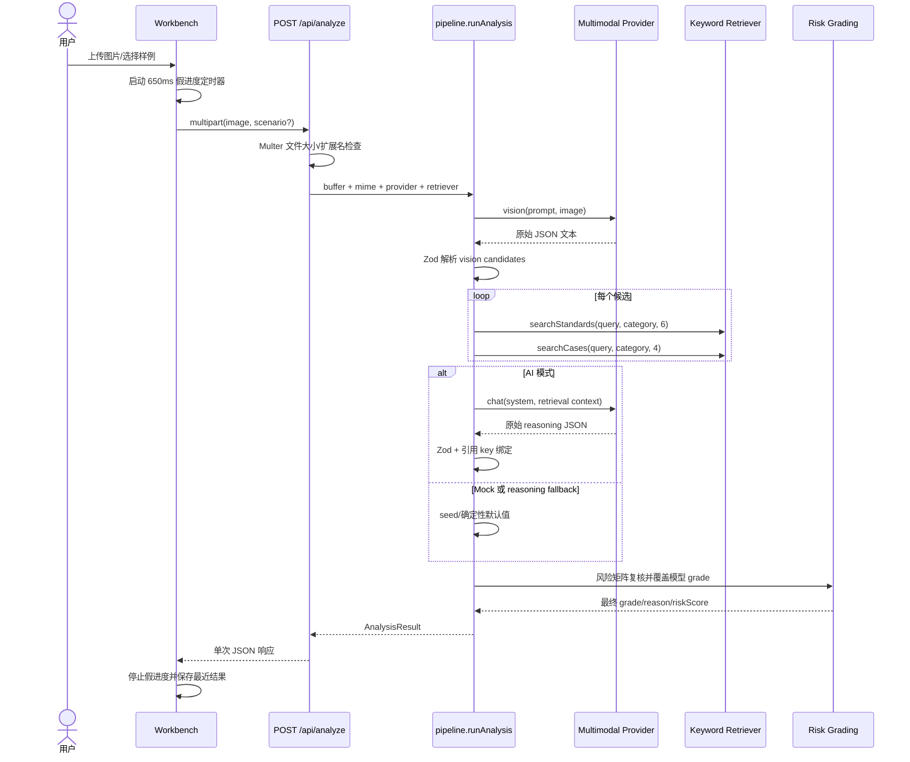
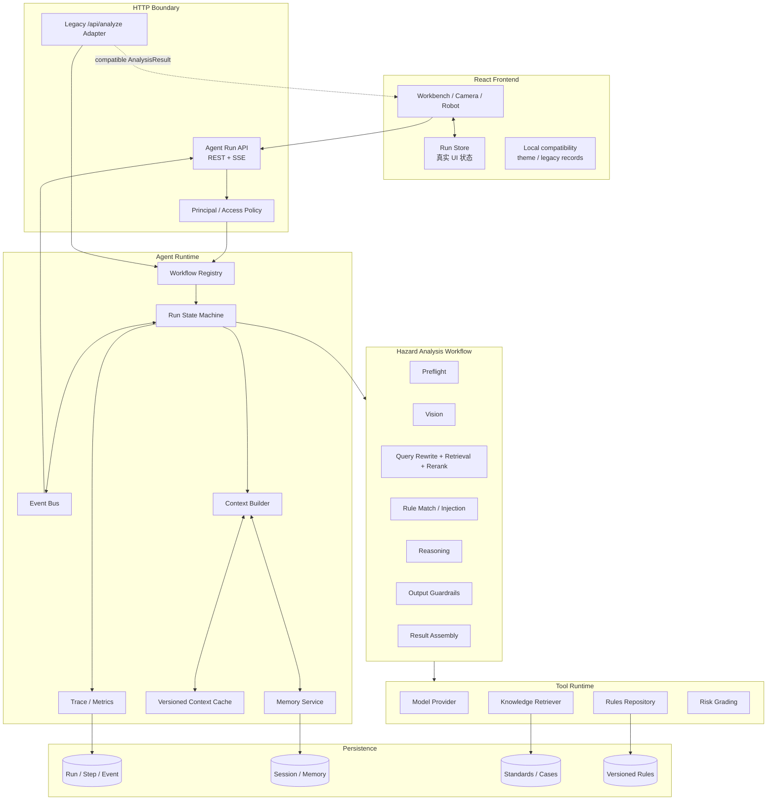
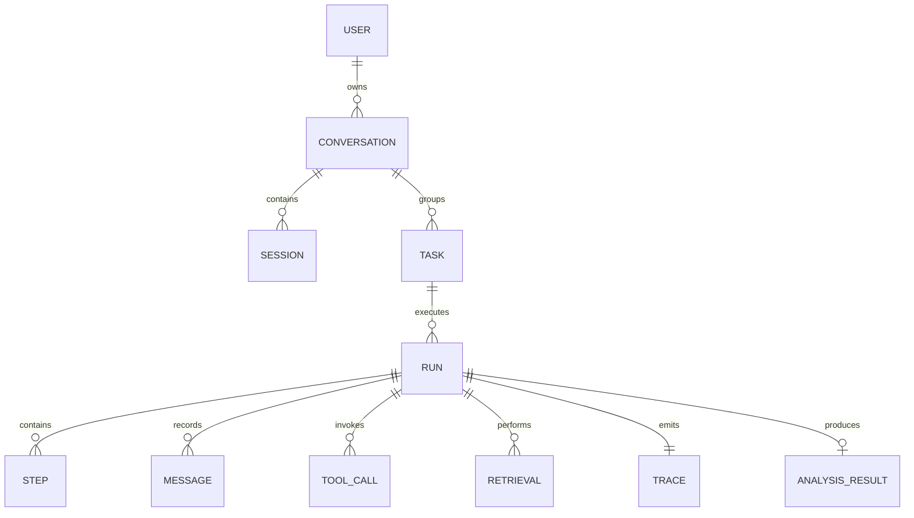
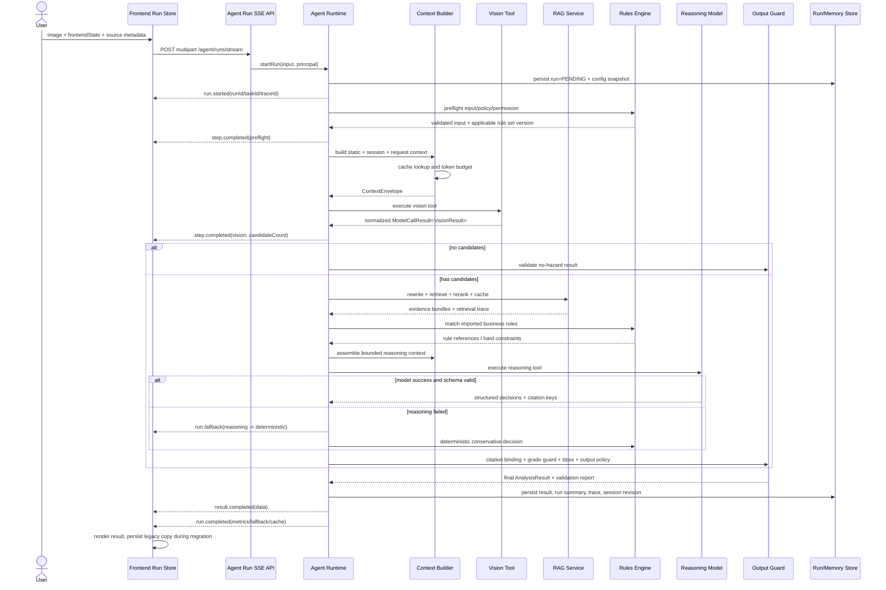
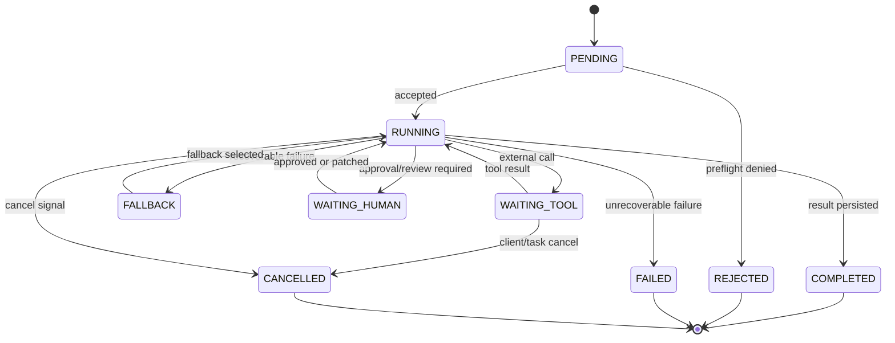
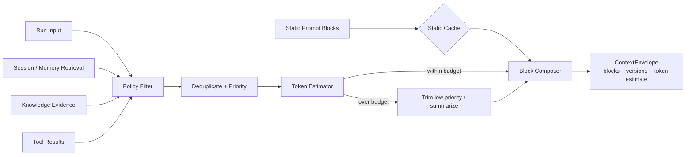
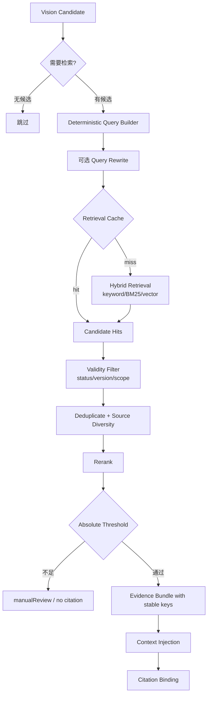
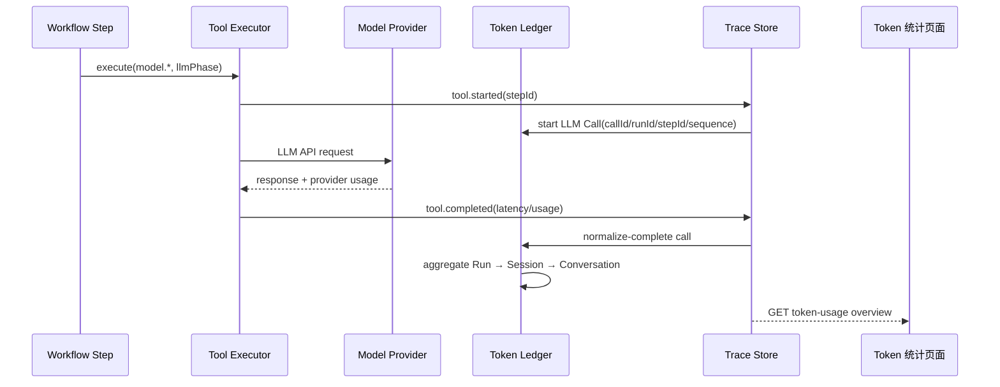

# Agent Runtime / Workflow 系统性重构设计

> 文档状态：v1.0（基于当前仓库代码审计）  
> 适用项目：核电工程隐患智能识别与定级系统 Demo  
> 设计日期：2026-08-23  
> 核心原则：保留现有图片识别、标注、人工编辑、报告、摄像头/机器人巡检、知识库和规则库交互；将一次性分析流水线演进为可追踪、可缓存、可扩展的显式 Agent Runtime。

## 1. 结论先行

当前系统已经有一个合理的领域流水线雏形：`Vision -> Knowledge Retrieval -> LLM Reasoning -> Schema Validation -> Risk Guardrail`。它适合继续作为“图片隐患分析工作流”的领域内核，不应改造成自由规划、无限工具循环的通用聊天 Agent。

真正缺失的是流水线外围的 Agent Runtime：

- 没有 `conversation / session / task / run / step / trace` 等稳定运行实体；
- 没有真实的工作流状态机，前端进度由定时器模拟；
- 没有上下文分层、token budget、Context Cache、版本和失效机制；
- 没有短期、Session、长期记忆的边界，也没有后端历史隔离；
- 规则库、知识库和模型 Prompt 没有统一的版本、优先级与冲突处理；
- 595 条已导入判定规则只用于页面展示和图谱，未进入分析链路；
- Provider 只返回字符串，模型调用的 token、latency、retry、fallback 无统一观测；
- 没有工具注册、统一执行结果、超时/幂等/副作用模型；
- 失败回退虽然存在，但前端无法知道发生过 fallback，也无法定位失败节点。

目标架构采用：

1. **显式、确定性的 workflow graph** 作为当前图片分析主流程；
2. **Agent Runtime** 负责 ID、状态、事件、上下文、缓存、记忆、工具执行和 trace；
3. **Rules Engine** 负责确定性前置/后置校验和规则优先级；
4. **RAG Service** 负责检索触发、query rewrite、召回、rerank、去重和知识版本；
5. **SSE over fetch** 向现有 React UI 推送真实阶段事件；
6. 保留 `POST /api/analyze` 兼容接口，新工作台优先使用 `POST /api/agent/runs/stream`；
7. 当前工作流不采用自由 planner-executor。未来复杂处置任务可作为独立 workflow 注册。

## 2. 审计范围与证据

本设计已检查：

- 前端入口、hash 路由、9 个页面、核心组件和 API 客户端；
- 图片工作台、固定摄像头、机器人巡检、记录、台账、知识库、规则库、图谱、设置页；
- Express 应用、全部路由、`pipeline.ts`、Provider、Prompt、Zod Schema、风险定级、知识检索、规则解析与持久化；
- 3 类标准知识源、历史案例和已导入规则数据；
- README、现有架构文档、环境变量、构建配置和 Git 状态；
- 本地页面的真实可见状态及 Mock 分析 happy path；
- 基线 `npm run typecheck`（审计时通过）。

当前数据规模：

| 数据源 | 当前规模 | 当前用途 |
| --- | ---: | --- |
| 通用标准 | 9 个文档 / 38 条款 | 页面展示 + 分析检索 |
| 核电专用标准 | 6 个文档 / 20 条款 | 页面展示 + 分析检索 |
| 企业文件 | 4 个文档 / 10 条款 | 页面展示 + 分析检索 |
| 历史案例 | 28 条 | 页面检索 + 分析相似案例 |
| 导入判定规则 | 595 条（a/b/c 领域分类） | **仅页面与图谱，未参与分析** |
| 自动化测试 | 0 | 无回归保护 |

## 3. 当前前端结构与交互流程

### 3.1 页面结构

| 路由 | 页面 | 用户主流程 | 状态位置 |
| --- | --- | --- | --- |
| `#/` | 工程现场智能识别 | 上传/样例 -> 分析 -> 查看 bbox/依据/案例/建议 -> 人工编辑 -> 保存/导出 | React local state + `localStorage` |
| `#/discover/camera` | 固定摄像头抓隐患 | 选择设备 -> 抓拍 -> 单图分析 -> 转台账 | 页面 local state + 台账 `localStorage` |
| `#/discover/robot` | 机器人寻隐患 | 选择机器人 -> 顺序巡检多个点位 -> 汇总 -> 转台账 | 页面 local state + 台账 `localStorage` |
| `#/records` | 隐患记录 | 查看、恢复、导出、删除已保存结果 | `localStorage`，最多 30 条 |
| `#/prevent` | 隐患防控 | 手工登记、改责任/期限/状态、导出台账 | `localStorage`，最多 200 条 |
| `#/knowledge` | 标准知识库 | 类型筛选、查看文档与条款 | 后端 JSON，经 REST 读取 |
| `#/cases` | 历史案例 | 搜索、类别/等级筛选 | 后端 JSON，经 REST 读取 |
| `#/rules` | 定级规则库 | 导入 TXT、筛选、清空 | `.rules-imported.json` |
| `#/graph` | 规则知识图谱 | 导入 TXT/CSV、展开/搜索/导出 PNG | `.rules-imported.json` + 页面布局状态 |
| `#/settings` | 系统设置 | 模型配置、连通性、Mock/AI、主题 | `.runtime-model.json` + `localStorage` |

### 3.2 当前工作台状态机

前端 `Phase` 只有：

```text
idle -> ready -> analyzing -> done | empty | error
```

`analyzing` 内部的六步进度并非后端状态：`Workbench.tsx` 每 650ms 自增 `progressStep`。Mock 请求足够快时，界面会直接从 ready 跳到 done，六步甚至来不及展示。前端不知道正在发生 vision、retrieval、reasoning 还是 fallback。

### 3.3 当前真实调用链



### 3.4 当前状态管理和长期信息

| 信息 | 当前实现 | 问题 |
| --- | --- | --- |
| 当前图片与结果 | Workbench local state | 路由离开即依赖恢复逻辑 |
| 最近一次结果 | `hazard.lastResult.v1` | 仅单浏览器、无用户/会话隔离 |
| 保存记录 | `hazard.records.v1` | 最多 30 条；没有后端检索、并发或审计 |
| 台账 | `hazard.ledger.v1` | 最多 200 条；无权限、审批、版本和签字 |
| 主题 | `localStorage` | 合理，继续保留前端 |
| 模型配置 | `.runtime-model.json` | 进程级全局配置；API Key 明文落盘；无权限 |
| 导入规则 | `.rules-imported.json` | 读写失败静默；无 revision/status/audit |
| Session Memory | 不存在 | 无 session summary/revision |
| 用户历史 | 仅本地记录 | 不进入 Agent，也不可按用户检索 |
| Agent 执行历史 | 不存在 | 只有最终 `AnalysisResult` |
| 知识库历史 | 静态 JSON | 无知识版本、发布时间/生效区间校验 |

### 3.5 前端对 Agent 的实际需求

当前 UI 需要的是“高确定性、多阶段、可解释的图片分析执行器”，而非开放式聊天：

- 输入是图片和来源状态（工作台/摄像头/机器人、设备、点位、scenario）；
- 输出必须是严格结构化 `AnalysisResult`，支持 bbox 与人工编辑；
- 需要展示真实阶段，而不是模型隐藏推理文本；
- 需要明确 retrieval、rule check、model、fallback、manual review 的可见状态；
- 机器人场景需要父任务与多个子 run；
- 结果需可保存、恢复、导出并进入隐患台账；
- 安全结论必须经过确定性规则守卫，模型不能直接决定最终等级。

## 4. 当前 Agent/Prompt/Tool/Workflow 实现盘点

### 4.1 Prompt

- `VISION_SYSTEM_PROMPT`：负责客观图像观察、0~10 候选、bbox、Observed Fact/Inference 区分；
- `buildReasoningSystemPrompt()`：负责法规引用、历史案例、定级、整改建议；
- `buildReasoningUserPrompt()`：把每个候选与 Top-K 条款/案例拼成单个字符串。

目前没有：Prompt ID、版本、hash、变更记录、token 预算、静态/动态块边界、供应商 prompt cache key。

### 4.2 Tool

当前没有模型自主 tool calling。Provider 的 `vision/chat/healthCheck` 是直接方法调用；retrieval 和 grading 也是普通函数。没有统一 tool schema、执行 envelope、超时策略、幂等 key、side-effect 分类和 normalization。

这是合理的起点：当前安全工作流不应让模型自由决定是否执行风险护栏。新架构将这些能力注册为 runtime tool，但由 workflow 确定性选择；只有未来开放式工作流才允许受限 tool selection。

### 4.3 Workflow

`pipeline.ts` 是一个 300 余行的过程式函数。它包含阶段概念，但没有显式节点状态、节点输入输出契约、retry/fallback policy 或可恢复 checkpoint。

### 4.4 Memory / Session / History

后端没有任何 conversation/session/memory 实现。图片分析彼此独立；历史案例是知识库，不是用户/Agent memory。浏览器保存的记录没有被下一次请求读取或注入 Prompt。

## 5. 当前架构存在的问题

| 优先级 | 具体问题与代码证据 | 产生的问题 | 推荐替代 |
| --- | --- | --- | --- |
| P0 | 导入规则仅被 `/api/rules` 和图谱使用，`pipeline.ts` 不调用 `getRules()` | 用户以为规则参与定级，实际没有 | Rule Repository + Rule Matcher + Prompt rule refs + 后置守卫 |
| P0 | 无 auth/tenant/permission middleware | 模型配置、规则导入/清空和数据读取均为全局开放 | 先定义 Principal/Policy 接口；生产接 IAM/RBAC，Demo 显式标记 anonymous |
| P0 | 模型输出 fallback 对前端不可见 | 200 响应可能是规则回退，但 UI 显示“AI 分析完成” | 事件与结果 meta 中记录 fallback/manual review |
| P1 | 前端进度为 650ms 定时器 | UI 阶段与真实后端状态不一致 | SSE 真实 `step.started/completed/failed` |
| P1 | 无 run/trace/step/model-call/retrieval 记录 | 无法解释慢、错、重复请求、缓存命中 | Agent Runtime + Trace Store |
| P1 | `buildReasoningUserPrompt` 将“类别”写成 `title` | Prompt 类别信息错误 | 结构化 ContextBlock，类型层面要求 category |
| P1 | Reasoning 要求完善 title/description/confidence，但 finalize 丢弃这些字段 | 模型做了无效工作，Prompt/代码契约不一致 | 明确字段所有权；视觉事实默认只读，reasoning 仅输出判断字段 |
| P1 | `reasoningResult.needManualReview` 未进入最终判断 | 模型的整体复核请求被忽略 | Output assembler 合并 run/hazard/manual-review 信号 |
| P1 | 模型不引用条款时自动塞入 Top4 | 可能形成“系统代替模型引用”的虚假解释 | 最低相关度 + citation policy；未选中时标记无引用/复核，不自动伪造原因 |
| P1 | relevance/similarity 相对本次最高分归一化 | 很弱的唯一命中也可能显示 95% | 使用可解释 absolute score + calibrated band |
| P1 | `nextAnalysisId` 进程内日计数 | 重启/多实例会碰撞 | UUID/ULID runId；analysisId 使用时间+随机后缀或数据库序列 |
| P1 | 无 prompt/rule/kb/model 版本 | 结果不可复现 | 每个 run 固化 `configSnapshot` |
| P1 | Provider 只返回 string | 无 token、finish reason、request id | 统一 `ModelCallResult` |
| P1 | Provider 对 4xx/5xx 全部重试 | 无效请求重复、延迟增加 | 仅 408/409/429/5xx retry，指数退避+jitter |
| P1 | `.runtime-model.json` 明文 API Key 且无权限 | 凭据风险 | 生产 secret manager；返回 API 永不泄露；配置写权限策略 |
| P2 | 工作台人工改 grade 不重算 `overallRisk`，也不标记人工修改 | 汇总和单项不一致，审计缺失 | `applyHumanPatch` 统一派生字段 + audit record |
| P2 | 历史/台账只在 localStorage，异常全部静默 | 丢失、不可共享、不可审计 | 后端 repository；迁移期继续本地兼容 |
| P2 | 机器人串行子任务只有页面状态 | 刷新后任务丢失、无法取消/恢复 | task -> child runs；后端持久化/checkpoint |
| P2 | README 声称持续免责声明，但 `DISCLAIMER=''` | 产品声明与实际结果不一致 | 规则化 disclaimer 与人工复核状态 |
| P2 | 无测试 | 重构风险高 | 单元、契约、workflow、SSE、前端回归测试 |

## 6. 目标总体架构



### 6.1 设计边界

- **Runtime** 不包含核电业务判断，只负责编排基础设施；
- **Workflow** 决定本领域节点和跳转；
- **Rules Engine** 是确定性权威，不由模型绕过；
- **Prompt** 只承载模型必须理解的软规则、当前证据和引用候选；
- **前端** 维护展示状态，后端维护事实状态；
- **Memory** 不等于把所有历史塞入 Prompt；默认图片分析彼此隔离；
- **Trace** 可记录决策摘要，但不记录/暴露模型隐藏思维链。

## 7. ID 与运行实体



| ID | 含义 | 生命周期 |
| --- | --- | --- |
| `userId` | 已认证用户；Demo 固定 `anonymous-demo` | 长期 |
| `conversationId` | 一个连续工作语境 | 跨多个 task/run |
| `sessionId` | 一次前端活动会话，带 revision | 页面/登录会话 |
| `taskId` | 业务任务；单图任务或机器人整次巡检 | 直到闭环 |
| `runId` | 一次不可变执行尝试；重试生成新 run | 一次执行 |
| `parentRunId` | 机器人父任务或未来多 Agent 父 run | 可选 |
| `messageId` | 输入/输出消息；图片任务也保留输入消息 | run 内 |
| `stepId` | 一次节点执行 | run 内 |
| `traceId` | 端到端观测关联 ID | 一次 run |
| `analysisId` | 面向业务展示的分析编号 | 最终结果 |

ID 使用 UUID/ULID，不再依赖进程内计数。业务展示可额外生成 `HAZ-yyyyMMdd-xxxxxx`，但唯一性由 runId 保证。

## 8. 完整 Agent 执行流程



## 9. Workflow / State Machine 设计

### 9.1 模式选择

当前场景选择**显式 workflow graph**，不选择自由 planner-executor，原因是：

- 主路径固定且法规/风险护栏不可跳过；
- 模型只适合做视觉理解与受约束推理，不应规划权限或规则节点；
- 前端已经按阶段展示，显式状态可以直接映射 UI；
- fallback 和人工复核条件需要可证明、可测试。

未来“制定跨部门整改计划”等开放任务可以注册为 `planner-executor` workflow，但仍由 Runtime 限制工具、预算和审批节点。

### 9.2 Run 状态



### 9.3 节点契约

| 节点 | 输入 | 输出/状态 | 执行与跳转 | Retry / Fallback / Error |
| --- | --- | --- | --- | --- |
| `accept_input` | principal、IDs、图片元数据、frontendState | immutable RunInput | 总是 | 非法 ID/负载 -> REJECTED |
| `preflight` | RunInput、permission/rule snapshot | ValidatedInput | 总是 | MIME/大小/权限失败 -> REJECTED |
| `resolve_intent` | workflowType/source | `image_hazard_analysis` | 当前 UI 确定性路由 | 未支持 workflow -> REJECTED |
| `build_base_context` | prompt/rule/model versions | StaticContext | 总是 | cache miss 重建；失败 -> FAILED |
| `load_memory` | user/conversation/session/task | MemorySelection | policy 决定；当前单图默认只取 task metadata | store 失败 -> 空 memory + fallback event |
| `vision` | image + vision context | candidates/imageSummary | 总是 | 429/5xx/timeout 可重试；AI 失败 -> FAILED 或显式 Mock（仅策略允许） |
| `retrieval_plan` | candidates | rewritten queries | candidates > 0 | rewrite 失败用 deterministic query |
| `retrieve` | query/category/kbVersion | standard/case hits | candidates > 0 | cache；单源失败可继续，全部失败 -> manual review |
| `rerank` | raw hits | bounded evidence bundles | hits > 0 | 确定性 fallback 排序 |
| `match_rules` | candidate + ruleVersion | rule matches/hard constraints | candidates > 0 | repository 失败 -> 内置风险矩阵仍执行 + fallback |
| `build_reasoning_context` | evidence/rules/memory/budget | ContextEnvelope | candidates > 0 | 超预算按裁剪策略；不足 -> manual review |
| `reason` | ContextEnvelope | structured decisions | AI mode | parse retry 最多 1 次；失败 -> deterministic conservative path |
| `bind_citations` | decision keys + evidence map | real references | reason 后 | 未知 key 丢弃并记 validation issue，禁止编造 |
| `post_rules` | candidate + decisions | guarded hazards | 总是 | grade matrix、bbox、文本、安全动作；失败 -> FAILED |
| `assemble_result` | guarded hazards + run meta | AnalysisResult | 总是 | 派生 stats/overall/manual review |
| `persist` | run/result/summary/trace | revision/checkpoint | 总是 | Demo 可降级内存；生产失败不得声称 durable |
| `complete` | persisted result | COMPLETED event | persist 后 | SSE 断开不改变后端最终事实 |

## 10. Context 构建流程

### 10.1 上下文分层

优先级从高到低：

| 层 | 内容 | 是否进入模型 | 缓存边界 |
| --- | --- | --- | --- |
| L0 Platform Safety | 输出格式、安全边界、禁止伪造引用 | 必须 | promptVersion 级长期缓存 |
| L1 Developer/Workflow | 节点职责、字段所有权、tool policy | 必须 | workflowVersion + promptVersion |
| L2 Deterministic Business Rules | 风险矩阵、权限、必须停工/复核条件 | 只注入模型需理解的摘要；权威执行在代码 | ruleSetVersion |
| L3 Session Context | 当前会话目标、最近明确用户约束、session summary | 按 workflow policy | sessionId + revision |
| L4 Task/Run Input | 图片摘要、来源设备/点位、frontendState | 必须、动态 | 不跨 run 缓存 |
| L5 Retrieved Knowledge | 标准、案例、匹配规则 | 必须、动态 | kb/rule version + query |
| L6 Tool Results | vision candidates、normalized errors/results | 后续节点按需 | run 内缓存 |
| L7 History/Long-term Memory | 用户偏好、历史任务摘要 | 仅检索命中且允许 | user scope + memory revision |

确定性规则永远不因 Prompt 中遗漏而失效。Prompt 中的规则摘要只是帮助模型生成解释和建议。

### 10.2 Context Builder



### 10.3 Context block 数据结构

```ts
interface ContextBlock {
  id: string;
  kind: 'system' | 'developer' | 'business_rule' | 'session' |
    'history' | 'knowledge' | 'tool_result' | 'frontend_state';
  priority: number;
  content: string;
  sourceIds: string[];
  version: string;
  cacheable: boolean;
  estimatedTokens: number;
  sensitivity: 'public' | 'internal' | 'restricted';
  expiresAt?: string;
}

interface ContextEnvelope {
  blocks: ContextBlock[];
  versions: ContextVersions;
  budget: { limit: number; used: number; reservedOutput: number };
  dropped: Array<{ blockId: string; reason: string }>;
  hash: string;
}
```

### 10.4 Token budget 与裁剪

默认预算由 Model Profile 决定，不在 Prompt 内硬编码。建议初始分配：

| 内容 | 建议占可用输入比例 | 裁剪规则 |
| --- | ---: | --- |
| System/Developer | 15% | 不裁剪，只能通过版本优化 |
| Business rule summary | 10% | 保留 hard/命中规则，删除未命中说明 |
| 当前 candidate/vision evidence | 20% | 不删除可见事实；合并重复证据 |
| 标准条款 | 25% | 每隐患先保底多源，再按 rerank 分数 |
| 历史案例 | 15% | 每隐患最多 3；保留描述/等级/整改摘要 |
| Session/history | 5% | 当前图片工作流默认不注入旧结果正文 |
| 余量 | 10% | tool error、schema repair 等 |

裁剪顺序：重复内容 -> 低于阈值知识 -> 额外历史案例 -> 非命中软规则 -> 长期记忆 -> session 旧消息。绝不裁剪 hard rules、当前图片事实、引用 key 映射和输出 schema。

## 11. Context Cache 设计

### 11.1 缓存类型

| Cache | Key | Value | TTL/容量 | 失效 |
| --- | --- | --- | --- | --- |
| Static Prompt Cache | `workflowVersion:promptVersion:modelProfile` | L0/L1 blocks | 24h / 100 | prompt/workflow/model profile 变更 |
| Rule Context Cache | `tenant:ruleSetVersion:workflow` | 规则摘要/索引 | 1h / 100 | 导入、启用、停用、版本发布 |
| Retrieval Cache | `kbVersion:sourceSet:normalizedQuery:category:topK:rerankVersion` | evidence hits | 10m / 2000 | KB 发布/撤回、rerank 版本变更 |
| Session Context Cache | `tenant:user:conversation:sessionRevision` | summary + recent constraints | 5m / 1000 | 新 message/run summary 写入 |
| Tool Result Cache | `runId:toolName:inputHash:toolVersion` | normalized result | run lifetime | run 结束；side-effect tool 默认禁用 |
| Image Vision Cache | `imageSha256:model:visionPromptVersion` | candidates | 可选 30m | 模型/prompt 变更；生产默认需租户策略允许 |

### 11.2 Cache key 规则

- 只使用 canonical JSON 后的 SHA-256，不把 API Key、原图 base64 或个人敏感文本直接放 key；
- key 必须包含 tenant scope、数据版本、算法版本和关键参数；
- 命中缓存时仍执行当前 run 的权限与后置规则；
- cache value 带 `createdAt/expiresAt/sourceVersion/contentHash`；
- 单进程 Demo 使用有界 LRU+TTL；生产替换 Redis，不改变接口。

### 11.3 版本与失效

```text
promptVersion  = 显式语义版本 + prompt content hash
workflowVersion = 节点图/契约版本
ruleSetVersion = 发布 revision/hash（不是文件 mtime）
kbVersion = 所有有效文档 id/version/status/content hash 的聚合 hash
rerankVersion = 算法/模型版本
memoryRevision = 每次持久化摘要自增
```

失效采用“版本进入 key”为主、主动删除为辅。旧 run 固化旧版本，不因新规则发布而被改写。

## 12. Memory / History 设计

### 12.1 三层记忆

| 类型 | 内容 | 持久化 | 当前图片工作流使用方式 |
| --- | --- | --- | --- |
| Run Working Memory | 当前 candidates、retrieval、tool result、节点状态 | run checkpoint/短期 | 全量在 run 内，结束后只保留摘要和 trace |
| Session Memory | 当前目标、用户明确修订、最近 run 摘要、未完成事项 | conversation/session store | 默认仅注入当前 task 约束，不注入旧图片结论 |
| Long-term Memory | 稳定偏好、经过确认的业务事实、历史任务摘要索引 | user/tenant scope | query 命中且 policy 允许时检索，不全量注入 |

历史案例属于 Knowledge Base，不属于用户 Memory。人工修改的隐患结论属于 Task History，必须与 AI 原始输出分别保存。

### 12.2 摘要与压缩

- 每个 run 完成后生成确定性 `RunSummary`：输入来源、隐患数、最高等级、fallback、manual review、引用 ID、人工变更数；
- 不把原图 base64 写入 memory；只存 object reference/hash；
- session 最近保留 N 条结构化摘要，不保留无限消息；
- 超阈值后生成滚动 summary，原消息仍在持久层，可按需检索；
- 摘要必须带 source run IDs，禁止失去溯源。

### 12.3 隔离

所有 memory 查询必须同时满足：

```text
tenantId + principal permissions + userId + conversationId/taskId policy
```

禁止默认跨 user、跨 tenant、跨 conversation 注入。机器人父 task 可以读取自己的 child run summary；工作台新图片不读取无关历史图片正文。

## 13. Knowledge Base / RAG 流程



### 13.1 触发条件

- 无 candidate：不检索；
- 有 candidate：默认检索标准、案例和匹配判定规则；
- 仅需重新导出/查看：不检索；
- 人工只修改描述：不自动检索，除非用户显式请求重新校验；
- 同 run 重复 query：复用 run tool cache；跨 run 由 retrieval cache 决定。

### 13.2 Query 生成/重写

第一版使用确定性 query：`category + title + observed evidence + normalized synonyms`，避免为了 rewrite 再调用一次模型。仅在 query 过长、类别未知或召回为零时启用受限模型 rewrite；rewrite 输出保留原 query，并记录 trace。

### 13.3 Retrieval / Rerank

迁移期复用当前 keyword retriever，外包一层：

1. normalize；
2. keyword/category recall；
3. absolute score；
4. 文档有效状态过滤；
5. 按 clause/case ID 去重；
6. 通用/核电/企业来源多样性；
7. topK token-aware 截断；
8. 生成稳定 evidence key。

接口预留 keyword/BM25/vector 多路召回与 cross-encoder rerank，workflow 不依赖具体实现。

### 13.4 冲突优先级

```text
确定性平台安全规则
  > 已发布且适用的业务 hard rule
  > 有效受控企业文件（适用范围内）
  > 有效核电专项标准
  > 有效通用标准
  > 已确认人工 task 决策
  > 历史案例
  > 模型推断
```

冲突不能静默覆盖：输出 `ConflictRecord`，高风险冲突触发 `manualReviewRequired=true`。历史案例只能辅助，不覆盖现行规则。

## 14. Rules Engine / Rule Injection

### 14.1 规则分类

| 规则类型 | 示例 | 位置 |
| --- | --- | --- |
| 输入确定性规则 | MIME、15MB、workflow、ID 格式、权限 | 执行前代码校验 |
| 执行确定性规则 | 必须检索、最大候选数、工具预算、timeout | Workflow/Runtime |
| 领域 hard rule | 风险矩阵、A/B 级处置、强条、citation 约束 | Rules Engine，权威 |
| 模型解释规则 | Observed Fact/Inference、建议具体可执行 | Prompt |
| 输出确定性规则 | Zod、bbox、riskScore、未知引用、免责声明 | 执行后代码校验 |
| UI 协同规则 | 按 backend event 展示；人工修改标记 | 前后端协议 |

### 14.2 导入规则的正确使用

当前导入规则的 `a/b/c` 表示“基础管理/现场作业/特殊作业”分类，不是 A/B/C/D 风险等级。新架构不得把 `level=b` 直接解释为 B 级隐患。

规则匹配输出：

```ts
interface RuleMatch {
  key: string;
  ruleId: string;
  code: string;
  taxonomyLevel: string;
  text: string;
  starred: boolean;
  relevance: number;
  effect: 'context' | 'requires_review' | 'hard_constraint';
  version: string;
}
```

初始迁移中，普通导入规则为 `context`；星标规则至少触发 `requires_review`。只有经过发布配置明确声明 effect 的规则才能成为 `hard_constraint`。

### 14.3 优先级与版本

每条规则带：`tenantId/ruleSetId/version/status/effectiveFrom/effectiveTo/priority/effect/sourceHash`。只有 `published + effective + scope matched` 的规则进入执行。导入动作创建 draft revision，发布才更新 `activeRuleSetVersion` 并使缓存失效。

## 15. Tool Calling 设计

### 15.1 当前策略

当前 workflow 使用确定性 tool selection：

- `vision.analyze`：外部、只读、可重试；
- `knowledge.retrieve`：内部、只读、可缓存；
- `rules.match`：内部、只读、可缓存；
- `model.reason`：外部、只读、可重试；
- `risk.grade`：内部、确定性、不可跳过；
- `result.persist`：有副作用，必须幂等。

模型不能选择跳过 `risk.grade` 或自行调用 `result.persist`。

### 15.2 Tool schema 与执行 envelope

```ts
interface ToolDefinition<I, O> {
  name: string;
  version: string;
  inputSchema: ZodSchema<I>;
  outputSchema: ZodSchema<O>;
  sideEffect: 'none' | 'idempotent' | 'non_idempotent';
  timeoutMs: number;
  retryPolicy: RetryPolicy;
  sensitivity: 'public' | 'internal' | 'restricted';
  execute(input: I, ctx: ToolExecutionContext): Promise<O>;
}

interface ToolExecutionResult<O> {
  toolCallId: string;
  status: 'succeeded' | 'failed' | 'timed_out' | 'cancelled';
  normalizedOutput?: O;
  error?: NormalizedError;
  attempts: number;
  latencyMs: number;
  cacheHit: boolean;
  idempotencyKey?: string;
}
```

### 15.3 连续调用、retry 与副作用

- 每个 run 有 `maxToolCalls/maxModelCalls/maxRetrievals/deadline`；
- retry 只对声明为 retryable 的错误；
- 模型 schema repair 算新的 model call，并计预算；
- side-effect tool 必须携带 `taskId + operation + inputHash` 幂等 key；
- 非幂等操作未来必须进入 human approval；
- tool result 默认只以摘要进入后续 Context，原始大对象存 artifact store；
- 原图/base64 和凭据不得写 trace。

## 16. 前后端状态同步

### 16.1 状态所有权

| 状态 | 前端 | 后端 |
| --- | --- | --- |
| 当前选中的图片/标注/Tab/Drawer | 权威 | 不维护 |
| Run status/current step/fallback/error | 投影 | **权威** |
| workflow input/config snapshot | 展示副本 | **权威** |
| Agent 原始输出 | 展示副本 | **权威、不可变** |
| 人工编辑 draft | 权威，提交前 | 不维护 |
| 已提交人工修订/audit | 投影 | **权威**（目标态） |
| theme | 权威 | 不维护 |
| conversation/task/run IDs | 保存并透传 | 生成/校验、权威 |
| 摄像头/机器人设备状态 | 当前 Demo 前端 mock | 生产后端设备服务权威 |

### 16.2 UI 映射

| UI | 后端事件/状态 |
| --- | --- |
| loading | `run.started` 到首个 step |
| 图像解析/识别 | `step.*` + `uiStage=vision` |
| 知识检索 | `uiStage=retrieval` |
| 历史匹配 | `uiStage=history` |
| 规则定级 | `uiStage=rules/reasoning/validation` |
| 整改建议 | `uiStage=reasoning/assemble` |
| fallback banner | `run.fallback` |
| 人工复核提示 | `run.requires_review` 或结果字段 |
| 完成 | `result.completed` + `run.completed` |
| 失败 | `run.failed`，包含安全可展示 error |

前端不得展示模型隐藏 reasoning/chain-of-thought。只展示节点名、工具名、引用数量、规则调整、fallback 原因和人工复核要求。

## 17. Streaming Event Protocol

### 17.1 传输

- 端点：`POST /api/agent/runs/stream`；
- 请求：`multipart/form-data`；
- 响应：`text/event-stream; charset=utf-8`；
- 使用 `fetch()` 读取流，因为原生 `EventSource` 不支持 multipart POST；
- 每个事件含单调递增 `sequence`；客户端断线后可通过 `GET /api/agent/runs/:runId/events?after=` 补取；
- 15 秒 heartbeat；代理层禁用 buffering。

### 17.2 Event envelope

```ts
type AgentEventType =
  | 'run.started' | 'run.completed' | 'run.failed' | 'run.cancelled'
  | 'step.started' | 'step.progress' | 'step.completed' | 'step.failed'
  | 'tool.started' | 'tool.completed' | 'tool.failed'
  | 'retrieval.completed' | 'cache.hit' | 'cache.miss'
  | 'run.fallback' | 'run.requires_review' | 'result.completed'
  | 'heartbeat';

interface AgentStreamEvent<T = unknown> {
  protocolVersion: '1.0';
  eventId: string;
  sequence: number;
  type: AgentEventType;
  timestamp: string;
  traceId: string;
  runId: string;
  taskId: string;
  stepId?: string;
  phase?: string;
  uiStage?: 'preflight' | 'vision' | 'retrieval' | 'history' |
    'rules' | 'reasoning' | 'validation' | 'assemble';
  payload: T;
}
```

SSE 示例：

```text
id: 7
event: step.completed
data: {"protocolVersion":"1.0","sequence":7,"type":"step.completed","runId":"...","uiStage":"retrieval","payload":{"standards":12,"cases":6,"cacheHit":false}}

```

### 17.3 顺序与幂等

- `(runId, sequence)` 唯一；
- 客户端忽略 `sequence <= lastSequence` 的重复事件；
- `result.completed` 最多一次；
- `run.completed/failed/cancelled` 是终结事件；
- 终结事件后不再发送业务事件。

## 18. 核心数据结构

```ts
interface AgentRun {
  runId: string;
  traceId: string;
  taskId: string;
  conversationId: string;
  sessionId: string;
  userId: string;
  workflowType: 'image_hazard_analysis';
  workflowVersion: string;
  status: RunStatus;
  currentStep?: string;
  inputRef: { imageHash: string; mimeType: string; source: string };
  configSnapshot: {
    model: string;
    promptVersion: string;
    ruleSetVersion: string;
    knowledgeVersion: string;
    rerankVersion: string;
  };
  metrics: RunMetrics;
  fallback?: FallbackRecord;
  resultRef?: string;
  createdAt: string;
  updatedAt: string;
}

interface FrontendState {
  source: 'workbench' | 'camera' | 'robot';
  deviceId?: string;
  stationId?: string;
  scenarioId?: string;
  locale?: string;
  selectedHazardId?: string;
}

interface AnalysisAgentMeta {
  runId: string;
  traceId: string;
  taskId: string;
  workflowVersion: string;
  promptVersion: string;
  ruleSetVersion: string;
  knowledgeVersion: string;
  fallbackUsed: boolean;
  cache: { hits: number; misses: number };
  durationMs: number;
}
```

`AnalysisResult` 保持现有字段，新增可选 `agentMeta`，从而兼容浏览器中已保存的 v1 结果。

人工修订使用 patch 记录而不是覆盖原始输出：

```ts
interface HumanRevision {
  revisionId: string;
  analysisId: string;
  hazardId: string;
  baseRunId: string;
  patch: Partial<Pick<Hazard, 'title' | 'description' | 'grade' | 'rectification'>>;
  authorId: string;
  reason?: string;
  createdAt: string;
}
```

## 19. 核心接口设计

| Method | Endpoint | 说明 |
| --- | --- | --- |
| POST | `/api/agent/runs/stream` | 创建 run 并 SSE 返回实时事件/结果 |
| POST | `/api/agent/runs` | 创建异步 run，立即返回 ID（未来机器人/批量） |
| GET | `/api/agent/runs/:runId` | 获取状态、结果摘要和 config snapshot |
| GET | `/api/agent/runs/:runId/events?after=N` | 补取事件 |
| POST | `/api/agent/runs/:runId/cancel` | 幂等取消 |
| GET | `/api/agent/traces/:traceId` | 调试 trace（受权限控制） |
| GET/POST | `/api/conversations/:id/...` | 会话与消息（未来对话工作流） |
| POST | `/api/analyses/:id/revisions` | 提交人工修订并重算派生汇总 |
| POST | `/api/analyze` | 兼容旧客户端；内部调用同一 runtime，返回最终 JSON |

首期实现 `stream`、`run detail`、`events` 与兼容 `/api/analyze`；取消、异步和人工修订接口按迁移阶段启用。

## 20. 缓存与持久化

### 20.1 Repository 接口优先

Runtime 只依赖：

```text
RunRepository
EventRepository
MemoryRepository
ArtifactRepository
RuleRepository
KnowledgeRepository
CacheStore
```

Demo 首期可使用进程内有界存储 + 原子 JSON snapshot；生产使用 PostgreSQL/对象存储/Redis。不可把 JSON 文件实现细节传播到 workflow。

### 20.2 持久化策略

- run/step/event：append 或事务写入；
- result：不可变原始结果 + revision；
- image：对象存储引用/hash，不写 JSON/base64；
- trace：默认保留 30 天，可配置；
- raw model response：默认不长期保存，调试采样且脱敏；
- cache：可丢失，不作为事实来源；
- localStorage：迁移期做离线/兼容副本，不再视为系统记录权威。

## 21. 异常处理与降级

| 失败点 | Retry | Fallback | 最终状态/前端提示 |
| --- | --- | --- | --- |
| 输入/权限 | 无 | 无 | REJECTED，明确错误码 |
| Vision 429/5xx/timeout | 受预算重试 | 策略允许时显式 Mock；默认不伪装 | FAILED 或 fallback banner |
| Vision JSON invalid | schema repair 1 次 | 无候选不可等同“无隐患” | FAILED/REQUIRES_REVIEW |
| 单知识源不可用 | 1 次 | 其他源继续 | run 继续 + degraded retrieval |
| 全部知识不可用 | 有限重试 | 无引用保守判断 | `manualReviewRequired=true` |
| Reasoning timeout/invalid | 1 次/repair | 确定性风险矩阵 + 模板建议 | completed with fallback |
| 引用 key 非法 | 无 | 丢弃非法引用 | validation issue + review |
| Rule repository 失败 | 有限重试 | 内置风险矩阵仍执行 | fallback + review |
| 持久化失败 | 生产重试 | Demo 内存 | 不得谎称 durable；事件明确 |
| SSE 断线 | 无业务重试 | run 后台继续；补取事件 | 前端 reconnect/query |
| 前端刷新 | 无 | 通过 runId 恢复 | 显示后端真实状态 |

错误使用稳定 code：`INPUT_* / AUTH_* / MODEL_* / RETRIEVAL_* / RULE_* / VALIDATION_* / PERSISTENCE_* / INTERNAL`。对前端返回安全消息，详细 stack 仅写 trace。

## 22. Observability / Trace

### 22.1 观测实体

```text
trace
  run
    step
      model_call
      tool_call
      retrieval
      rule_evaluation
      cache_access
```

### 22.2 必采字段

| 实体 | 字段 |
| --- | --- |
| Run | workflow/version、model、status、duration、fallback、manual review、result count |
| Step | name、attempt、start/end、input/output hash、status、error code |
| Model call | provider/model、prompt version/hash、input/output tokens、latency、finish reason、request id、retry |
| Tool call | name/version、sideEffect、idempotency key、attempt、timeout、normalized status |
| Retrieval | query hash、source、topK、raw/filtered/reranked count、kbVersion、latency |
| Rules | ruleSetVersion、matched IDs、hard decisions、conflicts、adjustments |
| Cache | cache name、key hash、hit/miss、age、version |
| Error/Fallback | normalized code、retryable、selected fallback、user-visible impact |

禁止记录 API Key、原图 base64、完整受限文档、用户敏感内容和隐藏思维链。日志使用 JSON；Metrics 至少包含 p50/p95 latency、success/fallback/error rate、token、cache hit、manual-review rate。

## 23. 权限与安全约束

当前仓库没有认证、授权、租户隔离、CSRF/速率限制；“安全员 · 演示”只是 UI 文本。新架构先把权限决策点固化：

- `PrincipalResolver`：从可信认证层生成 principal，禁止信任前端自报 userId/role；
- `AccessPolicy`：`run:create/read/cancel`、`rule:import/publish/clear`、`model:configure`、`trace:read`；
- 工具与知识源带 allowed scopes；
- 管理类接口必须审计；
- Prompt 不承担权限控制；
- Demo anonymous 模式应显式返回 `securityMode: demo-anonymous`，不可误认为生产安全。

## 24. 扩展性

### 24.1 新 Workflow

通过 `WorkflowRegistry.register(definition)` 增加：

- 视频抽帧分析；
- 机器人异步巡检（父 task + child run）；
- 隐患整改计划生成；
- 复查图前后对比；
- Human-in-the-loop 审批；
- 多 Agent 专家会审。

### 24.2 多 Agent

多 Agent 不应共享无边界 Prompt。父 orchestrator 只传递结构化 task envelope；子 Agent 各自有 run/trace/budget/tool allowlist。最终结论仍经同一 Rules Engine 和 Output Guard。专家意见冲突产生 `ConflictRecord`，不得按多数票直接覆盖 hard rule。

### 24.3 新模型/工具/知识库

- 模型通过 `ModelProvider` + Model Profile 注册；
- Tool 通过 schema/version/sideEffect 注册；
- 知识库通过 `KnowledgeSource` 注册并提供 source version；
- Rules 通过发布 revision 激活；
- Context Builder 与 workflow 只依赖统一接口。

## 25. 推荐代码目录结构

```text
shared/
  types.ts
  agent-protocol.ts          # run/event/context/meta 公共协议
  report.ts

server/
  agent/
    runtime.ts               # run 生命周期、预算、事件
    registry.ts              # workflow registry
    ids.ts
    errors.ts
    context/
      builder.ts
      blocks.ts
      token-budget.ts
    cache/
      versioned-cache.ts
    memory/
      memory-service.ts
      repositories.ts
    observability/
      trace-store.ts
      metrics.ts
    tools/
      registry.ts
      executor.ts
      types.ts
    workflows/
      hazard-analysis/
        definition.ts
        state.ts
        nodes/
          preflight.ts
          vision.ts
          retrieval.ts
          rules.ts
          reasoning.ts
          validation.ts
          assemble.ts
  rules/
    repository.ts
    matcher.ts
    engine.ts
    parser.ts
  retrieval/
    repository.ts
    query-builder.ts
    reranker.ts
    service.ts
  providers/
    types.ts
    openai-compatible.ts
    mock-provider.ts
  http/
    agent.routes.ts
    analysis.routes.ts        # legacy adapter
    ...

web/
  api/
    agent.ts                  # SSE fetch parser
    analysis.ts               # legacy/export
  agent/
    run-store.ts
    session.ts
    event-reducer.ts
  pages/
    Workbench.tsx
  components/
    AnalysisProgress.tsx
    RunFallbackBanner.tsx
    ...
```

首期不必机械拆成所有文件；但依赖方向必须遵守：HTTP -> Runtime -> Workflow -> domain service/tool -> repository/provider；反向依赖禁止。

## 26. 新旧架构迁移方案

### Phase 0：基线与契约

- 固化本设计；
- 为旧 `AnalysisResult`、risk grading、retrieval、Mock scenarios 添加测试；
- 建立共享 agent protocol，不改页面核心输出。

### Phase 1：Runtime 外壳与真实事件

- 引入 run/trace/event IDs、显式状态；
- 把现有 pipeline 包装为注册 workflow；
- 新增 SSE endpoint；
- Workbench 改用真实事件，保留 `/api/analyze`；
- 结果新增可选 `agentMeta`。

### Phase 2：Context/Cache/RAG/Rules 模块化

- Prompt 拆块并版本化；
- 引入有界 TTL cache；
- retrieval 加 query normalize、absolute score、source diversity、版本；
- 导入规则进入 match/injection，严格区分 taxonomy 与风险等级；
- 修复字段所有权、needManualReview 和 citation fallback 问题。

### Phase 3：Memory/Persistence

- 建立 Run/Session/Memory repository；
- 工作台记录和台账从 localStorage 双写，校验后切后端权威；
- 人工修改改为 revision/audit；
- 刷新后按 runId 恢复。

### Phase 4：异步与 Human-in-the-loop

- 机器人父 task/子 run、取消、恢复；
- A/B 级或规则冲突进入人工节点；
- 生产 IAM/RBAC、数据库、Redis、对象存储。

### 兼容矩阵

| 能力 | 迁移策略 |
| --- | --- |
| 上传/样例图片 | 保持 |
| `POST /api/analyze` | 保持，内部转 Runtime |
| `AnalysisResult` 现有字段 | 保持；只新增可选字段 |
| bbox/卡片/依据/案例/编辑 | 保持 |
| 保存记录/刷新恢复 | 迁移期继续 localStorage |
| 报告导出 | 保持，逐步加入 run metadata |
| 摄像头/机器人 | 初期继续同步 analyze；随后迁移 task/child run |
| 规则库/图谱 | 保持；新增 rule version/match，不误用 taxonomy |
| 工作台进度 | 改为真实 SSE 事件 |

## 27. 验证与验收标准

### 27.1 自动化

- `npm run typecheck`、`npm run build`；
- risk matrix 单元测试；
- Zod 模型输出与未知引用测试；
- retrieval cache key/version/expiry 测试；
- rule taxonomy 不等于风险 grade 的回归测试；
- workflow happy/no-hazard/model-fallback/retrieval-degraded 测试；
- SSE 事件顺序、终结唯一性、断线补取测试；
- `/api/analyze` 与新 endpoint 最终结果兼容测试。

### 27.2 端到端

1. 工作台 Mock 桌面样例：真实显示 vision/retrieval/rules/reasoning/validation，最终 3 条隐患；
2. clean 样例：无 candidate，检索与 reasoning 节点应明确 skipped；
3. reasoning 强制失败：返回保守结果并展示 fallback/manual review；
4. 同 query 第二次执行：retrieval cache hit 可在 trace 观察；
5. 导入规则后：ruleSetVersion 改变，旧 cache 不命中，匹配规则进入 trace/context；
6. 旧 `/api/analyze`、摄像头、机器人仍可工作；
7. 人工改 grade 后总体风险重算并标记人工修订（对应迁移阶段）。

## 28. 首期实现决策

本次重构按以下最小完整闭环落地，而不是一次性引入数据库或自由多 Agent：

1. 新增共享 Agent 协议；
2. 新增 Agent Runtime、run/event/trace 进程内存储和版本化 TTL Cache；
3. 将图片流水线改为显式节点并发出真实事件；
4. 新增 Context Builder、Prompt 版本与 token-aware evidence budget；
5. RAG 增加缓存、版本、query normalize 和来源多样性；
6. 将已导入规则以正确 taxonomy 语义接入匹配与 Context，星标触发复核；
7. 新增 SSE API、run detail/events API；旧 `/api/analyze` 走同一 runtime；
8. 工作台使用 SSE 事件替换定时器；结果显示 run/fallback/manual review 元数据；
9. 添加核心测试脚本并执行 typecheck/build/API/UI 验证。

数据库、生产 IAM、Redis、对象存储、机器人持久化父任务属于明确的后续阶段；接口在本次设计中预留，首期 Demo 实现不得声称已具备这些生产能力。

## 29. 本次落地状态与边界

截至本次重构，Phase 0～2 的首期闭环已经落地：共享协议、显式八节点 Workflow、统一 Runtime、真实 SSE、run/event/trace 查询、工具执行封装、版本化 Prompt 与 Context Builder、有界 TTL Cache、RAG 服务层、规则匹配与引用、风险/引用输出守卫、结构化 Session 摘要、前端真实进度和旧接口兼容均已有代码实现。自动化回归覆盖 happy path、无隐患跳过路径、推理降级、缓存复用、上下文预算、bbox 边界、规则 taxonomy、SSE 和旧接口兼容。

当前实现有以下明确边界：

- Run/Event/Session Memory 和 Context Cache 是有界进程内实现，重启后不保留，也不支持多实例共享；
- 历史隐患记录、整改台账和人工编辑仍以浏览器 localStorage 为迁移期兼容副本，尚非后端权威审计记录；
- 当前知识库是本地 JSON 上的关键词召回 + 确定性重排，规则匹配也是可解释的词项基线；它们已经具备版本、阈值、缓存与替换接口，但不等同于生产级 BM25/向量混合检索；
- Demo HTTP 边界固定为匿名 Principal，不信任前端自报 userId；生产 IAM/RBAC、租户隔离和资源级授权必须在持久化迁移前完成；
- 异步任务、取消/恢复、机器人父子 Run、人工审批节点和多 Agent 调度属于 Phase 3～4，不在本次首期代码中伪实现。

这些边界与前述迁移路线一致，后续实现应优先替换 Repository/Cache/Retriever/Rule Provider 适配器，而不重写 Workflow 契约或前端事件协议。

## 30. Token Usage Observability 落地设计

### 30.1 事实来源与统一语义

Token 统计的唯一事实来源是模型 Provider/SDK 返回的 `usage`。前端 Context 估算只用于请求前预算与裁剪，绝不进入 Token 账本。当前 OpenAI-compatible 适配器读取 `prompt_tokens`、`completion_tokens`、`total_tokens` 与 `prompt_tokens_details.cached_tokens`，在 Provider 边界归一化为：

- `inputTokens`：包含缓存输入在内的完整输入；
- `cachedTokens`：`inputTokens` 的子集；
- `uncachedInputTokens = inputTokens - cachedTokens`；
- `totalTokens`：优先使用 Provider 返回的 total；Provider 未返回 total 时才使用归一化后的 `input + output`；
- `cacheHitRate = cached / input`，input 为零时定义为 0；若任一有 usage 的调用未返回 cached 明细，则聚合同时标记 `cacheHitRateAvailable=false`，UI 显示“未返回”而不是把未知值猜成 0；
- Provider 完全未返回 usage 时保留 Call 记录并标为 `usageAvailable=false`，不使用字符数或前端估算补值；
- Mock Provider 的数据明确标记为 `mock_provider`，不得解释为真实计费量。

这里的 Cached Tokens 专指 Provider 返回的 prompt-cache token，不等同于本地静态 Prompt/Context/Retrieval Cache 的 `cache.hit`。两者在同一 Trace 中可按时间和 Step 关联分析，但不能把本地 cache hit 换算成未发生的模型 Token，也不能声称本地 Context Cache 直接节省了多少计费 Token。

未来 Anthropic、Gemini 或其他 Provider 必须各自在适配层把原始字段转换为同一“cached 是 input 子集”语义，并用供应商返回样例建立契约测试，Runtime 和前端不感知供应商字段。

### 30.2 Trace 层级与数据流



每个 `LLMCallUsage` 保存 Call/Run/Trace/Task/Conversation/Session/Step ID、Run 内序号、Provider、Model、LLM Phase、开始/完成时间、状态、实际 usage、缓存可用性、耗时与 Provider Attempts。Runtime 同时发出 `llm.call.started|completed|failed` 事件，因此调用级 Token 数据与 Step/Tool/Retrieval 共享同一条 Trace 时间线。

`RunTokenUsage` 只由该 Run 的 Calls 计算；`SessionTokenUsage` 和 `ConversationTokenUsage` 只由下属 Run 的 Calls 计算。聚合值不是独立可编辑事实，任何总量均能下钻回原始 Call。

### 30.3 查询接口与 UI

- `GET /api/agent/runs/:runId/token-usage`：单 Run 聚合与 Calls；
- `GET /api/agent/sessions/:sessionId/token-usage`：Session 下所有 Run 与 Calls；
- `GET /api/agent/conversations/:conversationId/token-usage`：Conversation 下所有 Run 与 Calls；
- `GET /api/agent/token-usage?conversationId=&sessionId=`：目录侧栏页面的一次性三级总览。

Token 页面支持 Run / Session / Conversation 范围切换、Run 选择、逐调用柱状图、总量柱状图和构成饼图。柱状图可并列展示 Input/Output/Cached；因为 Cached 是 Input 子集，饼图使用 `Uncached Input / Cached Input / Output` 三个互斥分区。调用列表可展开查看 Call ID、Step、阶段、模型、时间、耗时、缓存命中、usage 来源与失败状态。

当前 Ledger 与 Run Store 一样是有界进程内实现。生产迁移时应写入 append-only `llm_call_usage` 表并按 `(tenant_id, conversation_id, session_id, run_id, sequence)` 建索引；授权查询必须从认证 Principal 派生租户和用户范围，不能信任浏览器传入的身份字段。
