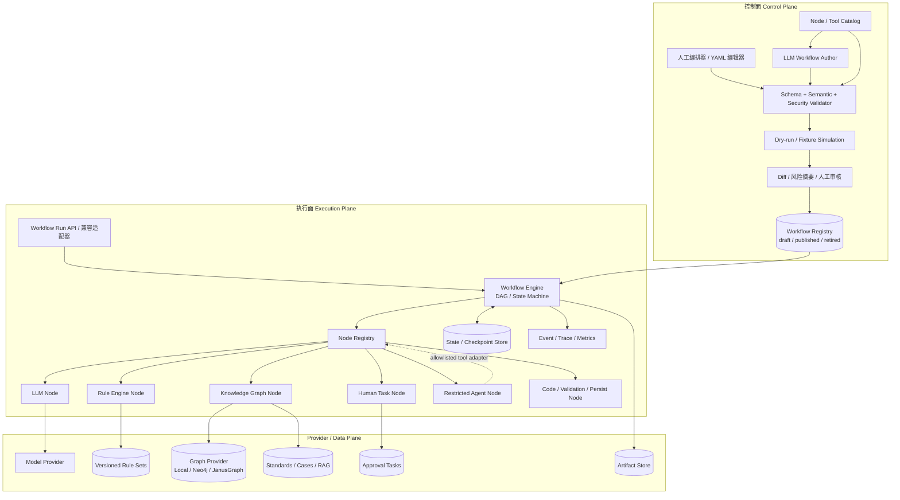
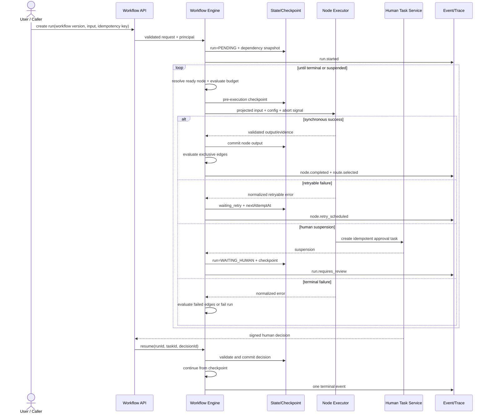
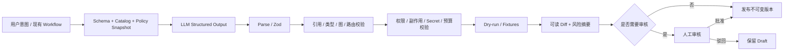

# 可配置智能决策 Workflow / Agent 架构设计

> 文档状态：目标架构与实施规范<br>
> 适用项目：核电工程隐患智能识别与定级系统 Demo<br>
> 基线日期：2026-08-26<br>
> 设计目标：配置驱动、可扩展、可审计、LLM 与人工均可编排，同时保持确定性安全边界<br>
> 相关文档：`系统架构说明.md`、`Agent运行时与工作流架构设计.md`、`Agent上下文Token可观测设计.md`（同目录）

## 1. 结论先行

本项目不需要把现有图片隐患分析改造成一个可以自由规划、无限调用工具的黑盒 Agent。当前代码已经形成了合理的确定性主链路：

```text
Preflight → Vision → Retrieval → Rules → Context → Reasoning → Validation → Assemble
```

目标架构应在这条链路之上补齐“配置、注册、校验、版本、审批和恢复”能力：

1. **Workflow 是默认编排单位**：固定顺序、条件分支、风险守卫、引用校验和人工复核都由可验证的 DAG / 状态机控制。
2. **Node 是统一执行单位**：LLM、Rule Engine、Knowledge Graph、Human Review 以及普通代码能力使用同一执行协议和注册机制。
3. **Tool 是 Node 的受限能力视图**：只有允许动态调用的 Node 才通过适配器暴露为 Agent Tool，避免维护两套执行语义。
4. **Agent 是受限的特殊 Node**：只在动态选择工具、动态拆解任务或无法预先枚举路径时使用；它不能跳过 Workflow 的权限、预算、审批和最终风险守卫。
5. **LLM 生成的是草稿，不是可执行事实**：生成或修改后的 Workflow 必须经过 Schema、语义、安全、图结构和权限校验，必要时人工审核，发布为不可变版本后才能执行。
6. **定级继续以现有 A/B/C/D 风险规则为权威**：KG 可以提供匹配、推理路径和评分依据，但不能静默改变最终定级公式。

### 1.1 本设计与当前实现的关系

| 当前实现 | 目标架构中的位置 | 迁移策略 |
| --- | --- | --- |
| `server/agent/runtime.ts` | Workflow Runtime / Run State Machine | 保留 Run、事件和观测能力，逐步抽出通用 Engine |
| `server/agent/workflows/hazard-analysis.ts` | `hazard-analysis` Workflow Definition + Node adapters | 先包装现有函数，再迁移为配置，不先重写业务逻辑 |
| `server/agent/tools/executor.ts` | Node Executor 基线 | 扩充输入/输出 Schema、幂等、checkpoint 和统一结果 envelope |
| `server/providers/` | LLM Node Provider | 保留 Provider 抽象，Node 负责 Prompt、结构化输出和策略 |
| `server/retrieval/` | Knowledge Search Node / KG 数据来源 | 继续提供 RAG；新增 KG Provider，不把 RAG 与图推理混为一谈 |
| `server/rules/` | Rule Repository / Rule Engine 基线 | 从“导入+匹配”演进到版本化规则集与受控 effect |
| `server/grading/risk-grading.ts` | `risk.grade` 确定性权威 Node | 保留公式和 guardrail，版本化后由 Workflow 强制执行 |
| `shared/agent-protocol.ts` | Run/Event 公共协议基线 | 兼容扩展 workflow/node/config/checkpoint/approval 字段 |
| 当前“知识图谱”页面 | 规则 taxonomy 径向树可视化 | 保留命名和功能，但不宣称它已是后端语义知识图谱 |

当前工作区已经具备 SSE、Run/Trace、Token Usage、Context Snapshot、规则版本、知识版本和 fallback 事件。这些能力应直接复用，不创建平行观测系统。

### 1.2 首个实施切片状态（2026-08-26）

以下基础能力已经开始落地：

- 权威 Zod Workflow DSL、Condition AST、State Patch、Node Policy 和统一 Node Protocol；
- 安全 YAML/JSON Loader、canonical JSON hash、Node Registry/Catalog 和多阶段 Validator；
- 单入口排他路由 Engine，支持输入投影、输出发布、条件分支、retry、timeout、幂等结果复用和 Human suspension 返回；
- 内置 `hazard-analysis.v1.yaml` draft，以及 Node Catalog、Workflow 列表/版本和配置校验 API；
- YAML 安全、图结构、条件求值、Engine、retry 和 HTTP 控制面的自动化测试。

当前内置核心 Node 只有 Schema/Catalog 契约，尚未逐个绑定现有业务函数，因此该 Workflow 保持 `draft`，发布和原生执行 API 暂不开放。现有 `/api/analyze` 与 `/api/agent/runs/stream` 继续走原 Agent Runtime；下一实施阶段是用适配器接入真实 Node，并完成行为等价迁移。

## 2. 设计原则与边界

### 2.1 原则

- **确定性优先**：能用 DAG、规则或类型安全条件表达的流程，不交给 Agent 临场决定。
- **配置与代码解耦，但配置不能执行任意代码**：DSL 只引用已注册、已版本化的 Node，条件只使用受限表达式 AST。
- **模型输出一律不可信**：LLM 输出先结构化校验，再做引用绑定、规则复核和输出守卫。
- **证据与结论分离**：RAG/KG/Rule 返回证据和建议，最终业务结论由明确的决策 Node 产生并记录依据。
- **发布版本不可变**：Run 固化 Workflow、Node、Prompt、Rule、Graph、Grading Policy 和模型版本，保证结果可复现。
- **人工决定是正式输入**：审批、驳回和修订必须形成独立审计记录，不覆盖 AI 原始结果。
- **安全失败**：视觉失败不能解释为“无隐患”；引用不足、规则冲突和降级必须显式触发复核或失败策略。

### 2.2 Workflow 与 Agent 的选择边界

| 场景 | 使用方式 | 原因 |
| --- | --- | --- |
| 图片隐患识别与定级 | 确定性 Workflow | 主链路固定，风险守卫和引用校验不可跳过 |
| A/B/C/D 风险计算 | Rule/Code Node | 公式明确、可测试，LLM 不应拥有最终权威 |
| 法规、案例、图谱检索 | Workflow 中的 Knowledge Node | 是否执行、topK、scope 和版本均可配置 |
| 基于证据生成解释和整改建议 | LLM Node | 需要语言推理，但输出可被 Schema 和规则约束 |
| A/B 级、星标规则、证据冲突 | Human Node | 需要责任主体签字或修订 |
| 跨部门整改计划动态拆解 | 受限 Agent Node | 子任务和工具选择难以完全预定义 |
| LLM 辅助编写 Workflow | 控制面 Authoring Agent | 只生成 draft，不直接发布或运行 |

除非满足“路径无法预先枚举且动态选择确实带来价值”，否则不新增 Agent。

## 3. 总体架构

架构分为控制面和执行面。两者共享 Schema、Registry 和版本仓库，但权限与操作完全分离。



### 3.1 控制面职责

- 接收人工 YAML/JSON 或 LLM structured output。
- 管理 draft、review、published、retired 版本及 content hash。
- 暴露当前用户可使用的 Node/Tool Catalog，而不是暴露全部系统能力。
- 执行多阶段校验、fixture 模拟、差异对比和风险分类。
- 对扩大权限、绕过审批、引入非幂等副作用或发布 hard rule 的变更强制审批。
- 只允许已发布、未撤销、签名有效的版本进入执行面。

### 3.2 执行面职责

- 加载不可变 Workflow 版本和完整依赖快照。
- 按 DAG ready queue 或状态机 transition 确定性执行。
- 在每次节点调用前做输入投影、Schema 校验、预算和权限检查。
- 管理 timeout、retry、idempotency、checkpoint、cancel 和 resume。
- 将节点结果以受控 patch 写入 State；大对象只保存 ArtifactRef。
- 发出与当前 SSE 兼容的 Run/Step/Tool/LLM/Cache/Review 事件。
- 终结 Run 前强制执行输出 Schema、风险守卫和持久化策略。

## 4. 统一领域对象与状态协议

### 4.1 标识和版本

```ts
interface WorkflowIdentity {
  workflowId: string;          // 例如 hazard-analysis
  workflowVersion: string;     // 发布版本，例如 1.0.0
  workflowHash: string;        // canonical JSON SHA-256
}

interface RuntimeDependencySnapshot extends WorkflowIdentity {
  nodeVersions: Record<string, string>;
  promptVersions: Record<string, string>;
  ruleSetVersion: string;
  graphVersion: string;
  gradingPolicyVersion: string;
  knowledgeVersion: string;
  modelProfileVersions: Record<string, string>;
}
```

`workflowVersion` 是可读的发布版本，`workflowHash` 用于识别真实内容。任何依赖版本变化都产生新的发布版本；已开始的 Run 不追随“最新”配置。

### 4.2 Run 和 Node 状态

```ts
type RunStatus =
  | 'pending'
  | 'running'
  | 'waiting_retry'
  | 'waiting_human'
  | 'succeeded'
  | 'failed'
  | 'cancelled'
  | 'rejected';

type NodeStatus =
  | 'pending'
  | 'ready'
  | 'running'
  | 'waiting_retry'
  | 'waiting_human'
  | 'succeeded'
  | 'failed'
  | 'skipped'
  | 'cancelled'
  | 'rejected';
```

合法状态转换由 Runtime 固化，配置不能改写。例如 `succeeded/failed/cancelled/rejected` 是 Run 终态；每个 Run 只能发出一个终结事件。`waiting_human` 不是终态，必须由 Human Decision 或 timeout transition 恢复。

### 4.3 Artifact、Evidence 和错误

```ts
interface ArtifactRef {
  artifactId: string;
  mediaType: string;
  sha256: string;
  bytes: number;
  storageClass: 'ephemeral' | 'durable';
  sensitivity: 'public' | 'internal' | 'restricted';
  expiresAt?: string;
}

interface EvidenceRef {
  evidenceId: string;
  sourceType: 'standard' | 'case' | 'rule' | 'graph_node' | 'graph_edge' | 'human';
  sourceId: string;
  sourceVersion: string;
  excerpt?: string;
  relevance?: number;
  pathId?: string;
}

interface NormalizedError {
  code: string;
  category:
    | 'input' | 'auth' | 'model' | 'rule' | 'knowledge'
    | 'validation' | 'timeout' | 'conflict' | 'persistence' | 'internal';
  message: string;             // 可安全返回给调用方
  retryable: boolean;
  detailsRef?: ArtifactRef;    // 受权限控制，不进入普通 SSE
  causedBy?: string;           // provider/node/error code，不含 stack 和 secret
}
```

原图/base64、API Key、完整受限文档、模型隐藏思维链和未经脱敏的异常堆栈不得进入普通 State/Event。

## 5. 统一 Node / Tool 接口

### 5.1 NodePlugin

```ts
import type { ZodType } from 'zod';

type SideEffect = 'none' | 'idempotent' | 'non_idempotent';
type ExecutionMode = 'sync' | 'async_suspend';
type Sensitivity = 'public' | 'internal' | 'restricted';

interface NodeCapabilities {
  executionMode: ExecutionMode;
  sideEffect: SideEffect;
  sensitivity: Sensitivity;
  agentCallable: boolean;
  supportsRetry: boolean;
  supportsDryRun: boolean;
  emitsEvidence: boolean;
}

interface NodePlugin<I, O, C> {
  readonly type: string;                // llm.vision / rules.evaluate / human.review
  readonly version: string;
  readonly inputSchema: ZodType<I>;
  readonly outputSchema: ZodType<O>;
  readonly configSchema: ZodType<C>;
  readonly capabilities: NodeCapabilities;

  execute(request: NodeExecutionRequest<I, C>): Promise<NodeExecutionResult<O>>;
  simulate?(request: NodeSimulationRequest<I, C>): Promise<NodeSimulationResult<O>>;
}

interface NodeExecutionRequest<I, C> {
  run: {
    runId: string;
    traceId: string;
    taskId: string;
    principal: PrincipalSnapshot;
    dependencies: RuntimeDependencySnapshot;
    activeDeadlineAt: string;
    lifecycleDeadlineAt: string;
  };
  node: {
    nodeId: string;
    nodeRunId: string;
    attempt: number;
    inputHash: string;
  };
  input: Readonly<I>;
  config: Readonly<C>;
  idempotencyKey?: string;
  services: RuntimeServices;
  signal: AbortSignal;
}

type NodeExecutionResult<O> =
  | {
      status: 'succeeded';
      output: O;
      evidence?: EvidenceRef[];
      warnings?: string[];
      decisionSummary?: Record<string, unknown>;
      artifacts?: ArtifactRef[];
    }
  | {
      status: 'waiting_human';
      suspension: HumanSuspension;
    }
  | {
      status: 'skipped';
      reason: string;
    }
  | {
      status: 'failed';
      error: NormalizedError;
    };
```

约束：

- Node 只能读取 Runtime 投影后的 `input`，不能直接遍历全局 State。
- Node 不能自行决定下一个节点；它只返回结果，由 Engine 根据 Edge 选择 transition。
- Node 输出必须通过 `outputSchema` 后才能提交 checkpoint。
- Node Provider 只能通过 `RuntimeServices` 获取，禁止从 DSL 注入构造函数、模块路径或任意 URL。
- 真实执行与 dry-run 使用不同 capability token，模拟不得触发外部副作用。

### 5.2 Tool 适配而不是第二套协议

```ts
interface AgentToolDescriptor {
  name: string;
  description: string;
  inputJsonSchema: object;
  outputJsonSchema: object;
  nodeType: string;
  nodeVersion: string;
  sideEffect: SideEffect;
  requiredScopes: string[];
}

interface ToolAdapter {
  fromNode(plugin: NodePlugin<unknown, unknown, unknown>): AgentToolDescriptor;
  invokeThroughNodeExecutor(
    descriptor: AgentToolDescriptor,
    input: unknown,
    agentContext: RestrictedAgentContext
  ): Promise<NodeExecutionResult<unknown>>;
}
```

只有同时满足以下条件的 Node 才能暴露为 Agent Tool：

1. `capabilities.agentCallable=true`；
2. 当前 Agent Profile allowlist 明确列出该 Node 及版本范围；
3. Principal 拥有所需 scope；
4. 剩余调用次数、Token、时间和费用预算充足；
5. `non_idempotent` Tool 已有有效人工批准，且批准绑定相同 input hash。

`risk.grade`、权限校验、最终引用守卫和结果持久化默认不对 Agent 开放。

### 5.3 Registry

```ts
interface NodeRegistry {
  register(plugin: NodePlugin<unknown, unknown, unknown>): void;
  resolve(type: string, version: string): NodePlugin<unknown, unknown, unknown>;
  catalog(principal: PrincipalSnapshot): NodeCatalogEntry[];
}
```

- Registry 启动时拒绝重复的 `type@version`。
- Workflow 发布时解析并锁定精确版本；执行时不使用浮动的 `latest`。
- Catalog 只返回当前 Principal 可以查看和使用的 Schema，Secret 值永不进入 Catalog。

## 6. Workflow DSL / Schema

### 6.1 表示方式与权威来源

- 人工首选 YAML；API 同时接受 JSON。
- YAML 解析后先拒绝重复 key、未知 tag、anchor 爆炸和超限文档，再转换为 canonical JSON。
- 当前 TypeScript 项目以 **Zod 3.x Schema** 为运行时权威；构建期使用兼容工具生成 JSON Schema。
- JSON Schema 用于编辑器提示、控制面表单和 LLM structured output，不单独手工维护，避免双 Schema 漂移。
- canonical JSON 使用稳定 key 排序并计算 SHA-256；审核、签名和发布均绑定该 hash。

### 6.2 顶层结构

```ts
interface WorkflowDefinition {
  apiVersion: 'workflow.openai.local/v1alpha1';
  kind: 'Workflow';
  metadata: {
    id: string;
    name: string;
    description?: string;
    version: string;
    labels?: Record<string, string>;
    owner: string;
  };
  spec: {
    mode: 'dag' | 'state_machine';
    inputSchemaRef: string;
    outputSchemaRef: string;
    initialState?: { data?: Record<string, unknown> };
    entryNodes: string[];
    terminalNodes: string[];
    dependencies: DependencyBindings;
    policies: WorkflowPolicies;
    nodes: NodeSpec[];
    edges: EdgeSpec[];
  };
}

interface NodeSpec {
  id: string;
  uses: string; // 精确的 type@version
  name?: string;
  with: Record<string, unknown>;
  input?: Record<string, ValueSource>;
  publish?: Array<{ from: string; to: string }>;
  policy?: Partial<NodePolicy>;
}

interface EdgeSpec {
  id: string;
  from: string;
  to: string;
  on: 'succeeded' | 'failed' | 'skipped' | 'approved' | 'rejected' | 'timed_out';
  when?: ConditionExpr;
  priority: number;
  transitionPatch?: StatePatchOperation[];
}
```

### 6.3 State 路径和输入映射

State 固定分区：

```text
input#/       不可变 Run 输入；图片等大对象是 ArtifactRef
data#/        Workflow 已发布的领域状态
nodes#/       每个 Node 的不可变执行结果和状态
approvals#/   Human Task 与 Decision 摘要
meta#/        Run、版本、预算、fallback 和安全元数据
```

路径语法是“固定 namespace + RFC 6901 JSON Pointer”，例如 `nodes#/vision/output/candidates/0`。禁止 `../`、通配符、动态函数、模板求值和跨租户引用。

```yaml
input:
  image:
    from: input#/image
  candidates:
    from: nodes#/vision/output/candidates
  locale:
    from: input#/locale
    default: zh-CN
publish:
  - from: output#/assessment
    to: data#/riskAssessment
```

Node 的完整输出总是自动保存到 `nodes#/<nodeId>/output`；`publish` 只把后续节点需要的稳定字段复制到 `data`。State Patch 只支持 `add/replace/test`，不允许节点任意删除审计事实。

### 6.4 条件表达式

```ts
type ConditionExpr =
  | { all: ConditionExpr[] }
  | { any: ConditionExpr[] }
  | { not: ConditionExpr }
  | { exists: { path: string } }
  | { eq: BinaryPredicate }
  | { in: { path: string; values: Array<string | number | boolean | null> } }
  | { gt: NumericPredicate }
  | { gte: NumericPredicate }
  | { lt: NumericPredicate }
  | { lte: NumericPredicate };

interface BinaryPredicate {
  path: string;
  value: string | number | boolean | null;
}

interface NumericPredicate {
  path: string;
  value: number;
}
```

示例：

```yaml
when:
  any:
    - in:
        path: nodes#/risk_grade/output/overallRisk
        values: [A, B]
    - eq:
        path: nodes#/risk_grade/output/requiresReview
        value: true
```

条件只读取已提交 checkpoint 的字段。敏感字段和 artifact 内容不能作为路由输入，除非 Node 先输出经过 Schema 约束的分类结果。

### 6.5 路由规则

- 同一 `from + on` 的 Edge 按 `priority` 从高到低求值。
- 默认使用排他路由：恰好一个条件为真才允许跳转。
- `onAmbiguous=fail`：多个同优先级或不允许并行的 Edge 同时命中时以 `WORKFLOW_ROUTE_AMBIGUOUS` 失败。
- `onNoMatch=fail`：没有命中且没有无条件 default Edge 时以 `WORKFLOW_ROUTE_NOT_FOUND` 失败。
- DAG 发布时必须无环且所有 Node 从 entry 可达、能到达 terminal。
- 状态机允许回边，但必须设置 `maxTransitions` 和 `maxVisitsPerNode`；Runtime 每次 transition 都扣减预算。
- 并行只在 DAG 中通过明确的 `fanOut` 和 `join: all|any` 声明；MVP 可以串行执行 ready nodes，但语义不得改变。

### 6.6 执行策略

```ts
interface WorkflowPolicies {
  activeExecutionMs: number;
  maxRunLifetimeMs: number;
  maxTransitions: number;
  maxVisitsPerNode: number;
  routing: {
    onAmbiguous: 'fail';
    onNoMatch: 'fail';
  };
  budgets: {
    maxNodeCalls: number;
    maxModelCalls: number;
    maxToolCalls: number;
    maxRetrievals: number;
    maxInputTokens?: number;
    maxOutputTokens?: number;
    maxEstimatedCost?: number;
  };
  security: {
    allowedNodeTypes: string[];
    allowedSecretRefs: string[];
    allowedKnowledgeScopes: string[];
    allowNonIdempotent: boolean;
    requireSignedDefinition: boolean;
  };
  human: {
    mode: 'block_and_resume' | 'flag_only';
  };
}
```

组织级上限由服务端策略控制。Workflow 只能把预算设得更小，不能通过配置扩大平台上限。

## 7. 完整图片隐患分析 Workflow 示例

以下 YAML 是目标 DSL 的完整示例。它保持现有核心行为，并显式增加 KG、Human 和安全分支。示例中的 Schema/Profile/Prompt/Rule/Graph 引用均由 Registry 解析，不能指向任意文件或 URL。

```yaml
apiVersion: workflow.openai.local/v1alpha1
kind: Workflow
metadata:
  id: hazard-analysis
  name: 核电工程图片隐患识别与定级
  description: 确定性编排视觉识别、知识匹配、规则评估、受约束推理、风险定级和人工复核
  version: 1.0.0
  owner: safety-platform
  labels:
    domain: nuclear-construction-safety
    compatibility: current-analysis-result-v2
spec:
  mode: dag
  inputSchemaRef: schema://hazard-analysis/input@1.0.0
  outputSchemaRef: schema://analysis-result@2.0.0
  initialState:
    data:
      fallback: {}
      reviewReasons: []
  entryNodes: [preflight]
  terminalNodes: [assemble, reject_run]
  dependencies:
    modelProfiles:
      vision: model-profile://multimodal-default@1.0.0
      reasoning: model-profile://reasoning-default@1.0.0
    prompts:
      vision: prompt://hazard-vision@2.0.0
      reasoning: prompt://hazard-reasoning@2.0.0
    ruleSet: ruleset://hazard-domain@1.0.0
    graph: graph://hazard-knowledge@1.0.0
    gradingPolicy: grading://abcd-risk-matrix@1.0.0
    knowledge: knowledge://controlled-safety-docs@1.0.0
  policies:
    activeExecutionMs: 300000
    maxRunLifetimeMs: 172800000
    maxTransitions: 32
    maxVisitsPerNode: 1
    routing:
      onAmbiguous: fail
      onNoMatch: fail
    budgets:
      maxNodeCalls: 16
      maxModelCalls: 5
      maxToolCalls: 16
      maxRetrievals: 10
      maxInputTokens: 60000
      maxOutputTokens: 8000
    security:
      allowedNodeTypes:
        - input.preflight
        - llm.vision
        - knowledge_graph.query
        - rules.evaluate
        - llm.reason
        - risk.grade
        - human.review
        - result.assemble
        - run.reject
      allowedSecretRefs:
        - secret://model/default
      allowedKnowledgeScopes:
        - general
        - nuclear
        - enterprise
        - historical_cases
      allowNonIdempotent: false
      requireSignedDefinition: true
    human:
      mode: block_and_resume
  nodes:
    - id: preflight
      name: 输入与权限预检
      uses: input.preflight@1.0.0
      with:
        acceptedMediaTypes: [image/jpeg, image/png, image/webp]
        maxBytes: 36700160
        requiredScope: workflow:hazard-analysis:run
      input:
        image:
          from: input#/image
        principal:
          from: meta#/principal
      policy:
        timeoutMs: 2000
        maxAttempts: 1

    - id: vision
      name: 多模态候选隐患识别
      uses: llm.vision@1.0.0
      with:
        modelProfileRef: model-profile://multimodal-default@1.0.0
        promptRef: prompt://hazard-vision@2.0.0
        outputSchemaRef: schema://vision-result@1.0.0
        maxCandidates: 10
      input:
        image:
          from: input#/image
        scenario:
          from: input#/scenario
          optional: true
        reasoningEffort:
          from: input#/reasoningEffort
          default: low
      publish:
        - from: output#/imageSummary
          to: data#/imageSummary
        - from: output#/candidates
          to: data#/candidates
        - from: output#/lowEvidence
          to: data#/lowEvidence
      policy:
        timeoutMs: 130000
        maxAttempts: 2
        backoff:
          type: exponential
          initialMs: 500
          maxMs: 3000
        retryOn: [MODEL_RATE_LIMITED, MODEL_UNAVAILABLE, TOOL_TIMEOUT]

    - id: kg_query
      name: 知识图谱查询与证据路径推理
      uses: knowledge_graph.query@1.0.0
      with:
        graphRef: graph://hazard-knowledge@1.0.0
        operation: match_and_assess
        maxPathsPerCandidate: 6
        maxDepth: 4
        asOfPolicy: run_started_at
        includeSources: [standard, case, rule]
      input:
        candidates:
          from: data#/candidates
        scope:
          from: input#/knowledgeScope
          default: [general, nuclear, enterprise, historical_cases]
        asOf:
          from: meta#/startedAt
      publish:
        - from: output#/assessments
          to: data#/kgAssessments
        - from: output#/degraded
          to: data#/fallback/kgDegraded
      policy:
        timeoutMs: 8000
        maxAttempts: 2
        retryOn: [KNOWLEDGE_UNAVAILABLE, TOOL_TIMEOUT]

    - id: rules_eval
      name: 领域规则评估
      uses: rules.evaluate@1.0.0
      with:
        ruleSetRef: ruleset://hazard-domain@1.0.0
        conflictPolicy: highest_priority_then_review
        includeEffects: [add_context, require_human_review, score_factor, hard_constraint]
      input:
        candidates:
          from: data#/candidates
        kgAssessments:
          from: data#/kgAssessments
          default: []
        asOf:
          from: meta#/startedAt
      publish:
        - from: output#/matches
          to: data#/ruleMatches
        - from: output#/requiresReview
          to: data#/ruleRequiresReview
        - from: output#/conflicts
          to: data#/ruleConflicts
      policy:
        timeoutMs: 5000
        maxAttempts: 1

    - id: reasoning
      name: 基于受控证据的推理与整改建议
      uses: llm.reason@1.0.0
      with:
        modelProfileRef: model-profile://reasoning-default@1.0.0
        promptRef: prompt://hazard-reasoning@2.0.0
        outputSchemaRef: schema://reasoning-result@2.0.0
        citationMode: keys_only
        contextBudgetPolicy: evidence_priority_v1
      input:
        candidates:
          from: data#/candidates
        kgAssessments:
          from: data#/kgAssessments
          default: []
        ruleMatches:
          from: data#/ruleMatches
          default: []
        knowledgeVersion:
          from: meta#/dependencies/knowledgeVersion
      publish:
        - from: output#/hazards
          to: data#/reasoningHazards
        - from: output#/needManualReview
          to: data#/llmRequiresReview
      policy:
        timeoutMs: 130000
        maxAttempts: 2
        retryOn: [MODEL_RATE_LIMITED, MODEL_UNAVAILABLE, MODEL_OUTPUT_INVALID, TOOL_TIMEOUT]
        schemaRepairAttempts: 1

    - id: risk_grade
      name: 引用绑定与 A/B/C/D 确定性定级
      uses: risk.grade@1.0.0
      with:
        policyRef: grading://abcd-risk-matrix@1.0.0
        bindCitationsByKey: true
        rejectUnknownCitations: true
        requireStandardEvidence: true
        modelGradeAuthority: advisory
      input:
        candidates:
          from: data#/candidates
        reasoningHazards:
          from: data#/reasoningHazards
          default: []
        kgAssessments:
          from: data#/kgAssessments
          default: []
        ruleMatches:
          from: data#/ruleMatches
          default: []
        fallback:
          from: data#/fallback
          default: {}
      publish:
        - from: output#/hazards
          to: data#/gradedHazards
        - from: output#/overallRisk
          to: data#/overallRisk
        - from: output#/requiresReview
          to: data#/requiresReview
        - from: output#/reviewReasons
          to: data#/reviewReasons
      policy:
        timeoutMs: 5000
        maxAttempts: 1

    - id: human_review
      name: 专业安全人员复核
      uses: human.review@1.0.0
      with:
        modeFromWorkflowPolicy: true
        assigneeRole: safety_reviewer
        decisionSchemaRef: schema://hazard-review-decision@1.0.0
        allowedDecisions: [approve, reject, patch]
        dueIn: PT24H
        onTimeout: reject
        requireReasonFor: [reject, patch]
        requirePatchWhenReasons: [vision_failed]
      input:
        analysisDraft:
          from: data#/gradedHazards
          default: []
        overallRisk:
          from: data#/overallRisk
          optional: true
        reasons:
          from: data#/reviewReasons
          default: []
        sourceRunId:
          from: meta#/runId
      publish:
        - from: output#/decision
          to: data#/humanDecision
        - from: output#/patchedHazards
          to: data#/humanPatchedHazards
      policy:
        timeoutMs: 5000
        maxAttempts: 1

    - id: assemble
      name: 组装兼容 AnalysisResult
      uses: result.assemble@2.0.0
      with:
        outputSchemaRef: schema://analysis-result@2.0.0
        disclaimerRef: text://hazard-ai-disclaimer@1.0.0
        preferHumanPatch: true
      input:
        imageSummary:
          from: data#/imageSummary
        hazards:
          from: data#/humanPatchedHazards
          fallbackFrom: data#/gradedHazards
          default: []
        overallRisk:
          from: data#/overallRisk
          optional: true
        reviewDecision:
          from: data#/humanDecision
          optional: true
        runMeta:
          from: meta#/
      policy:
        timeoutMs: 5000
        maxAttempts: 1
        idempotency:
          operation: assemble-analysis-result

    - id: reject_run
      name: 驳回复核结果
      uses: run.reject@1.0.0
      with:
        code: HUMAN_REVIEW_REJECTED
      input:
        decision:
          from: data#/humanDecision
      policy:
        timeoutMs: 2000
        maxAttempts: 1

  edges:
    - id: preflight_to_vision
      from: preflight
      to: vision
      on: succeeded
      priority: 100

    - id: vision_failure_to_review
      from: vision
      to: human_review
      on: failed
      priority: 100
      transitionPatch:
        - op: add
          path: data#/reviewReasons/-
          value: vision_failed

    - id: vision_clean_to_assemble
      from: vision
      to: assemble
      on: succeeded
      priority: 100
      when:
        all:
          - eq:
              path: nodes#/vision/output/candidateCount
              value: 0
          - eq:
              path: nodes#/vision/output/lowEvidence
              value: false

    - id: vision_uncertain_to_review
      from: vision
      to: human_review
      on: succeeded
      priority: 90
      when:
        all:
          - eq:
              path: nodes#/vision/output/candidateCount
              value: 0
          - eq:
              path: nodes#/vision/output/lowEvidence
              value: true
      transitionPatch:
        - op: add
          path: data#/reviewReasons/-
          value: no_candidate_but_low_evidence

    - id: vision_candidates_to_kg
      from: vision
      to: kg_query
      on: succeeded
      priority: 80
      when:
        gt:
          path: nodes#/vision/output/candidateCount
          value: 0

    - id: kg_to_rules
      from: kg_query
      to: rules_eval
      on: succeeded
      priority: 100

    - id: kg_degraded_to_rules
      from: kg_query
      to: rules_eval
      on: failed
      priority: 100
      transitionPatch:
        - op: add
          path: data#/fallback/kgDegraded
          value: true

    - id: rules_to_reasoning
      from: rules_eval
      to: reasoning
      on: succeeded
      priority: 100

    - id: rules_failure_to_grade
      from: rules_eval
      to: risk_grade
      on: failed
      priority: 100
      transitionPatch:
        - op: add
          path: data#/fallback/rulesFailed
          value: true

    - id: reasoning_to_grade
      from: reasoning
      to: risk_grade
      on: succeeded
      priority: 100

    - id: reasoning_failure_to_grade
      from: reasoning
      to: risk_grade
      on: failed
      priority: 100
      transitionPatch:
        - op: add
          path: data#/fallback/reasoningFailed
          value: true

    - id: grade_to_review
      from: risk_grade
      to: human_review
      on: succeeded
      priority: 100
      when:
        eq:
          path: nodes#/risk_grade/output/requiresReview
          value: true

    - id: grade_to_assemble
      from: risk_grade
      to: assemble
      on: succeeded
      priority: 90
      when:
        eq:
          path: nodes#/risk_grade/output/requiresReview
          value: false

    - id: review_approved_to_assemble
      from: human_review
      to: assemble
      on: approved
      priority: 100

    - id: review_flagged_to_assemble
      from: human_review
      to: assemble
      on: succeeded
      priority: 90
      when:
        eq:
          path: nodes#/human_review/output/mode
          value: flag_only

    - id: review_rejected_to_reject
      from: human_review
      to: reject_run
      on: rejected
      priority: 100

    - id: review_timeout_to_reject
      from: human_review
      to: reject_run
      on: timed_out
      priority: 100
```

### 7.1 示例语义说明

- `vision` 失败进入人工处理，绝不自动生成“无隐患”。
- `llm.vision` 适配器从已校验的 `candidates` 数组确定性派生 `candidateCount`；该字段不由模型自由填写。
- 没有候选且证据充分时直接组装无隐患结果；证据不足时人工复核。
- KG 故障允许降级继续，但 `fallback.kgDegraded` 最终会使 `risk.grade` 要求人工复核。
- Rule Engine 故障仍允许使用内置风险矩阵；Run 必须记录 fallback 并复核。
- Reasoning LLM 失败复用当前系统的确定性保守路径，不阻断 `risk.grade`。
- `risk.grade` 统一完成引用 key 绑定、未知引用处理、严重度/可能性规范化、A/B/C/D guardrail 和复核原因汇总。
- A/B 级、星标规则、证据不足、未知引用、KG/规则冲突或任一降级均可由 grading policy 设置 `requiresReview=true`。
- 原生异步 API 使用 `block_and_resume`。迁移期兼容接口通过受控 Execution Profile 把 Human Policy 收窄为 `flag_only`，返回 `needManualReview=true`；它不能修改 Workflow 的其他安全策略。
- `activeExecutionMs` 只累计实际运行/重试时间，Human waiting 不消耗该预算；`maxRunLifetimeMs` 覆盖从创建到终结的完整生命周期，`dueAt` 必须被截断在生命周期上限内。

## 8. 四类核心 Node 配置与协议

### 8.1 LLM Node

LLM Node 支持视觉理解、分类、证据约束推理和解释生成。不同能力可以共享执行插件，但应使用不同 `type` 或 operation profile，以便分别授权和观测。

```yaml
id: classify_work_type
uses: llm.classify@1.0.0
with:
  modelProfileRef: model-profile://text-low-latency@1.0.0
  promptRef: prompt://work-type-classifier@1.2.0
  outputSchemaRef: schema://work-type-classification@1.0.0
  temperature: 0
  maxOutputTokens: 800
  reasoningEffort: low
  allowedLabels: [高处作业, 临时用电, 起重吊装, 动火作业, 其他]
input:
  text:
    from: input#/description
policy:
  timeoutMs: 30000
  maxAttempts: 2
  schemaRepairAttempts: 1
```

- 输入：经过投影和大小限制的文本、图片 ArtifactRef 或证据 bundle。
- 输出：严格符合 `outputSchemaRef` 的业务对象、provider usage、引用 key 和非思维链式 `decisionSummary`。
- 错误：`MODEL_UNAVAILABLE`、`MODEL_RATE_LIMITED`、`MODEL_OUTPUT_INVALID`、`MODEL_POLICY_DENIED`、`TOOL_TIMEOUT`。
- 审计：model/profile/prompt/schema 版本、最终请求 hash、Token、延迟、request ID、repair/retry 次数；不保存隐藏思维链。

### 8.2 Rule Engine Node

```yaml
id: enforce_hot_work_policy
uses: rules.evaluate@1.0.0
with:
  ruleSetRef: ruleset://hot-work-safety@3.1.0
  evaluationMode: all_matches
  conflictPolicy: highest_priority_then_review
  includeEffects: [add_context, require_human_review, score_factor, hard_constraint]
input:
  facts:
    from: data#/normalizedFacts
  asOf:
    from: meta#/startedAt
```

- 输入：Schema 化事实、scope、as-of 时间和可选的 KG 证据。
- 输出：命中规则、每条 condition 结果、effect、冲突、未决事实、需要复核标记及 rule set version。
- 错误：`RULE_SET_NOT_PUBLISHED`、`RULE_SCOPE_DENIED`、`RULE_INPUT_INVALID`、`RULE_CONFLICT_UNRESOLVED`。
- 审计：命中/未命中规则 ID、revision、输入 hash、effect、优先级、冲突解决策略和最终应用动作。

### 8.3 Knowledge Graph Node

```yaml
id: assess_electrical_hazard
uses: knowledge_graph.query@1.0.0
with:
  graphRef: graph://hazard-knowledge@1.0.0
  operation: match_and_assess
  traversal:
    maxDepth: 4
    maxPaths: 12
    allowedRelations: [VIOLATES, MAY_CAUSE, CONTROLLED_BY, SIMILAR_TO, INDICATES]
  gradingPolicyRef: grading://abcd-risk-matrix@1.0.0
input:
  facts:
    from: data#/visibleFacts
  category:
    from: data#/category
  asOf:
    from: meta#/startedAt
```

- 输入：事实、候选实体、业务 scope、as-of 时间、graph version 和 policy version。
- 输出：实体匹配、关系路径、证据来源、推理规则、评分因子、建议等级、置信度、冲突和复核要求。
- 错误：`GRAPH_VERSION_NOT_FOUND`、`GRAPH_SCOPE_DENIED`、`GRAPH_QUERY_LIMIT`、`GRAPH_EVIDENCE_CONFLICT`、`KNOWLEDGE_UNAVAILABLE`。
- 审计：query hash、起止节点、边和来源版本、路径 ID、裁剪原因、评分因子来源及 provider latency。

### 8.4 Human Node

```yaml
id: approve_major_hazard
uses: human.review@1.0.0
with:
  assigneeRole: senior_safety_reviewer
  allowedDecisions: [approve, reject, patch]
  decisionSchemaRef: schema://hazard-review-decision@1.0.0
  dueIn: PT8H
  onTimeout: reject
  requireReasonFor: [reject, patch]
  requireSecondApproverWhen:
    in:
      path: input#/overallRisk
      values: [A]
input:
  draft:
    from: data#/analysisDraft
  evidence:
    from: data#/evidenceSummary
  overallRisk:
    from: data#/overallRisk
```

- 输入：只读草稿、证据摘要、复核原因和允许修改的字段 Schema。
- 输出：审批 task ID、decision、patch、author、role、reason、signedAt 和 decision hash。
- 等待：`block_and_resume` 时先返回 suspension，Run 进入 `waiting_human`；`flag_only` 只用于兼容或明确的非阻断流程。
- 错误：`APPROVAL_EXPIRED`、`APPROVAL_SCOPE_DENIED`、`APPROVAL_PATCH_INVALID`、`APPROVAL_CONFLICT`。
- 审计：创建、领取、转派、查看、决定、超时和恢复事件；重复提交相同 decision ID 返回第一次结果。

### 8.5 标准化输入、输出、错误与审计示例

以下示例展示四类 Node 进入统一执行协议后的落地形态。示例 hash 为缩写，生产记录保存完整值。

```json
{
  "llm": {
    "request": {
      "nodeId": "classify_work_type",
      "attempt": 1,
      "inputHash": "sha256:llm-input",
      "input": {
        "text": "配电箱门敞开，箱内线路接头裸露"
      }
    },
    "result": {
      "status": "succeeded",
      "output": {
        "label": "临时用电",
        "confidence": 0.93
      },
      "decisionSummary": {
        "selectedLabel": "临时用电",
        "schemaValidated": true
      }
    },
    "possibleError": {
      "code": "MODEL_OUTPUT_INVALID",
      "category": "model",
      "message": "模型输出未通过结构校验。",
      "retryable": true,
      "causedBy": "schema://work-type-classification@1.0.0"
    },
    "audit": {
      "nodeType": "llm.classify",
      "nodeVersion": "1.0.0",
      "modelProfileVersion": "1.0.0",
      "promptVersion": "1.2.0",
      "requestId": "provider-request-example",
      "inputTokens": 426,
      "outputTokens": 38,
      "latencyMs": 812,
      "schemaRepairAttempts": 0
    }
  },
  "rule": {
    "request": {
      "nodeId": "enforce_hot_work_policy",
      "inputHash": "sha256:rule-input",
      "input": {
        "facts": {
          "workType": "动火作业",
          "permitPresent": false
        },
        "asOf": "2026-08-26T01:30:00Z"
      }
    },
    "result": {
      "status": "succeeded",
      "output": {
        "ruleSetVersion": "3.1.0",
        "matches": [
          {
            "ruleId": "HOT-WORK-PERMIT-001",
            "priority": 900,
            "conditionMatched": true,
            "effects": [
              {
                "type": "require_human_review",
                "reasonCode": "missing_hot_work_permit"
              }
            ]
          }
        ],
        "conflicts": [],
        "requiresReview": true
      }
    },
    "possibleError": {
      "code": "RULE_SET_NOT_PUBLISHED",
      "category": "rule",
      "message": "指定规则集不是可执行的已发布版本。",
      "retryable": false
    },
    "audit": {
      "ruleSetId": "hot-work-safety",
      "ruleSetVersion": "3.1.0",
      "matchedRuleIds": ["HOT-WORK-PERMIT-001"],
      "appliedEffects": ["require_human_review"],
      "conflictPolicy": "highest_priority_then_review",
      "inputHash": "sha256:rule-input"
    }
  },
  "knowledgeGraph": {
    "request": {
      "nodeId": "assess_electrical_hazard",
      "inputHash": "sha256:kg-input",
      "input": {
        "facts": ["配电箱门敞开", "线路接头裸露"],
        "category": "临时用电",
        "asOf": "2026-08-26T01:30:00Z"
      }
    },
    "result": {
      "status": "succeeded",
      "output": {
        "graphVersion": "1.0.0",
        "assessments": [
          {
            "candidateRef": "H0",
            "matchedEntities": [
              {
                "entityId": "hazard:exposed-conductor",
                "type": "HazardType",
                "score": 0.94
              }
            ],
            "paths": [
              {
                "pathId": "path:H0:1",
                "nodeIds": ["fact:exposed-joint", "hazard:exposed-conductor", "consequence:electric-shock"],
                "edgeIds": ["edge:indicates:1", "edge:may-cause:3"],
                "sourceRefs": [
                  {
                    "evidenceId": "evidence:standard:DL-001-6.2.4",
                    "sourceType": "standard",
                    "sourceId": "DL-001-6.2.4",
                    "sourceVersion": "2026-controlled"
                  }
                ]
              }
            ],
            "factors": {
              "severity": {
                "value": 4,
                "evidenceIds": ["evidence:standard:DL-001-6.2.4"],
                "confidence": 0.88
              },
              "probability": {
                "value": 2,
                "evidenceIds": ["evidence:case:CASE-014"],
                "confidence": 0.71
              }
            },
            "suggestedGrade": "B",
            "confidence": 0.82,
            "conflicts": [],
            "requiresReview": false
          }
        ],
        "degraded": false
      }
    },
    "possibleError": {
      "code": "GRAPH_EVIDENCE_CONFLICT",
      "category": "conflict",
      "message": "图谱证据对评分因子给出冲突结论。",
      "retryable": false
    },
    "audit": {
      "providerId": "local-graph",
      "graphVersion": "1.0.0",
      "gradingPolicyVersion": "1.0.0",
      "queryHash": "sha256:kg-query",
      "pathIds": ["path:H0:1"],
      "truncatedPaths": 0,
      "latencyMs": 27
    }
  },
  "human": {
    "request": {
      "nodeId": "approve_major_hazard",
      "inputHash": "sha256:human-input",
      "input": {
        "overallRisk": "A",
        "reasons": ["major_hazard", "starred_imported_rule"]
      }
    },
    "result": {
      "status": "waiting_human",
      "suspension": {
        "taskId": "approval-task-example",
        "runId": "run-example",
        "nodeId": "approve_major_hazard",
        "status": "open",
        "assigneeRole": "senior_safety_reviewer",
        "inputHash": "sha256:human-input",
        "decisionSchemaRef": "schema://hazard-review-decision@1.0.0",
        "allowedDecisions": ["approve", "reject", "patch"],
        "dueAt": "2026-08-26T09:30:00Z",
        "resumeTokenHash": "sha256:resume-token"
      }
    },
    "decision": {
      "decisionId": "decision-example",
      "taskId": "approval-task-example",
      "action": "patch",
      "patch": [
        {
          "op": "replace",
          "path": "/hazards/0/gradeReason",
          "value": "经专业人员结合现场隔离状态复核后的定级理由。"
        }
      ],
      "reason": "补充现场隔离措施对风险暴露的影响。",
      "authorId": "reviewer-example",
      "authorRole": "senior_safety_reviewer",
      "decidedAt": "2026-08-26T02:10:00Z",
      "baseStateHash": "sha256:base-state",
      "signature": "signature:example"
    },
    "possibleError": {
      "code": "APPROVAL_CONFLICT",
      "category": "conflict",
      "message": "审批任务已由其他有效决定关闭。",
      "retryable": false
    },
    "audit": {
      "taskId": "approval-task-example",
      "decisionId": "decision-example",
      "authorId": "reviewer-example",
      "authorRole": "senior_safety_reviewer",
      "baseStateHash": "sha256:base-state",
      "patchHash": "sha256:human-patch",
      "signatureVerified": true,
      "resumeSequence": 18
    }
  }
}
```

## 9. Rule 配置模型

### 9.1 Rule Set 生命周期

```ts
type RevisionStatus = 'draft' | 'review' | 'published' | 'retired';

interface RuleSetRevision {
  ruleSetId: string;
  version: string;
  status: RevisionStatus;
  scope: {
    tenantId?: string;
    projects?: string[];
    workTypes?: string[];
  };
  effectiveFrom: string;
  effectiveTo?: string;
  conflictPolicy: 'highest_priority_then_review' | 'fail_closed';
  rules: ConfiguredRule[];
  sourceHash: string;
  createdBy: string;
  reviewedBy?: string;
  publishedAt?: string;
}

type RuleKind =
  | 'input_policy'
  | 'execution_policy'
  | 'domain_hard_rule'
  | 'scoring_rule'
  | 'llm_guidance'
  | 'routing_rule'
  | 'human_review_rule';

type RuleEffect =
  | { type: 'add_context'; templateRef: string }
  | { type: 'require_human_review'; reasonCode: string }
  | { type: 'score_factor'; factor: 'severity' | 'probability'; operation: 'set' | 'min' | 'max'; value: number }
  | { type: 'hard_constraint'; constraintRef: string }
  | { type: 'route_hint'; route: string };

interface ConfiguredRule {
  id: string;
  code: string;
  name: string;
  kind: RuleKind;
  taxonomy: { level: string; path: string[] };
  priority: number;
  enabled: boolean;
  condition: ConditionExpr;
  effects: RuleEffect[];
  explanation: string;
  provenance: { sourceType: string; sourceId: string; sourceVersion: string };
}
```

### 9.2 规则示例

```yaml
ruleSetId: hazard-domain
version: 1.0.0
status: published
scope:
  workTypes: [临时用电, 高处作业, 起重吊装]
effectiveFrom: 2026-08-26T00:00:00Z
conflictPolicy: highest_priority_then_review
sourceHash: sha256:example
createdBy: safety-rule-admin
reviewedBy: chief-safety-reviewer
publishedAt: 2026-08-26T01:00:00Z
rules:
  - id: RULE-BSD07
    code: BSD07
    name: 导入星标判定规则
    kind: human_review_rule
    taxonomy:
      level: b
      path: [现场作业, 隧道作业, 作业规程和要求]
    priority: 600
    enabled: true
    condition:
      eq:
        path: input#/matchedImportedRulesByCode/BSD07
        value: true
    effects:
      - type: add_context
        templateRef: text://imported-rule/BSD07
      - type: require_human_review
        reasonCode: starred_imported_rule
    explanation: 星标规则参与证据解释并强制复核，不直接覆盖 A/B/C/D 风险等级。
    provenance:
      sourceType: imported_rule
      sourceId: BSD07
      sourceVersion: import-batch-example
  - id: RULE-LLM-ELECTRICAL-001
    code: LLM-ELECTRICAL-001
    name: 临时用电证据约束提示规则
    kind: llm_guidance
    taxonomy:
      level: domain
      path: [临时用电, 证据表达]
    priority: 300
    enabled: true
    condition:
      eq:
        path: input#/category
        value: 临时用电
    effects:
      - type: add_context
        templateRef: prompt-block://rules/electrical-observed-facts@1.0.0
    explanation: 要求模型区分可见事实与推断，并只能引用本次 evidence map 中的 key。
    provenance:
      sourceType: controlled_rule_config
      sourceId: LLM-ELECTRICAL-001
      sourceVersion: 1.0.0
```

### 9.3 当前导入规则迁移约束

当前 `GradingRule.level` 的 `a/b/c` 是规则业务 taxonomy，不是 `Grade` 的 A/B/C/D：

- 普通导入规则初始 effect 固定为 `add_context`。
- `starred=true` 额外产生 `require_human_review`。
- 导入动作只能创建 draft revision；发布需要具备 `rule:publish` 权限的人工审核。
- 未经显式建模、回归测试和审批，导入规则不得产生 `score_factor` 或 `hard_constraint`。
- 如果多条 hard rule 冲突，不能让 LLM投票；按 priority 处理后仍冲突则 `requiresReview=true` 或 fail closed。

### 9.4 大模型规则与业务规则的解耦方式

Rule Engine 是通用解释器，规则内容保存在版本化 Rule Set 中，不为每条规则编写 `if/else` 代码：

- `input_policy/execution_policy/domain_hard_rule/scoring_rule/human_review_rule` 的 condition 由确定性 Rule Engine 求值，effect 由 allowlist 中的 typed handler 执行。
- `llm_guidance` 也是配置规则，但它的 effect 只能选择已审核的 `prompt-block://`，不能在规则文本中注入任意 system prompt、Tool 或 Secret。
- LLM guidance 只改变模型需要理解的上下文，不拥有最终 grade、权限、route 或副作用决定权；模型输出仍经过 `risk.grade` 和 output guard。
- 新增规则通常只新增 Rule Set revision；只有新增 condition operator 或 effect type 时才需要改 Engine 代码，并必须同步升级 Schema 和安全校验。
- Run 保存实际命中的 rule ID、condition 结果、effect、prompt block 版本和 rule set hash，使“某条大模型规则为何进入本次 Prompt”可以审计。

## 10. Knowledge Graph 与定级模型

### 10.1 当前事实与目标边界

当前项目存在：

- 本地标准条款、企业文件和历史案例 JSON；
- keyword/category 加权检索和确定性 rerank；
- 导入规则的 taxonomy 径向树；
- A/B/C/D 风险矩阵和模型输出 guardrail。

当前项目不存在后端图存储、统一 ontology、图查询语言或可追溯图推理服务。因此，目标 KG 必须以新增 Provider 接口实现，不能把现有前端径向树隐式视为完整 Knowledge Graph。

### 10.2 最小 ontology

MVP 建议使用以下可扩展类型：

```text
Entity:
  HazardType, ObservableFact, WorkActivity, Equipment, Location,
  Consequence, ControlMeasure, StandardClause, HistoricalCase, Rule

Relation:
  INDICATES, OCCURS_IN, INVOLVES, MAY_CAUSE, CONTROLLED_BY,
  VIOLATES, SIMILAR_TO, SUPPORTED_BY, CONFLICTS_WITH
```

每个 Node/Edge 至少包含 `id/type/version/validFrom/validTo/sourceRefs/attributes`。查询必须携带 `asOf`，失效或被撤回的受控文件不能作为当前定级依据。

### 10.3 Provider 接口

```ts
interface KnowledgeGraphProvider {
  readonly providerId: string;
  getVersion(graphRef: string): Promise<string>;

  matchAndAssess(input: KGAssessmentInput, ctx: KGQueryContext): Promise<KGAssessmentOutput>;
  query(input: KGQueryInput, ctx: KGQueryContext): Promise<KGQueryOutput>;
}

interface KGAssessmentInput {
  candidates: Array<{
    ref: string;
    category: string;
    facts: string[];
    possibleConsequence?: string;
  }>;
  scope: string[];
  asOf: string;
  graphVersion: string;
  gradingPolicyVersion: string;
  maxDepth: number;
  maxPathsPerCandidate: number;
}

interface KGAssessmentOutput {
  assessments: Array<{
    candidateRef: string;
    matchedEntities: Array<{ entityId: string; type: string; score: number }>;
    paths: Array<{
      pathId: string;
      nodeIds: string[];
      edgeIds: string[];
      inferenceRuleId?: string;
      sourceRefs: EvidenceRef[];
    }>;
    factors: {
      severity?: { value: number; evidenceIds: string[]; confidence: number };
      probability?: { value: number; evidenceIds: string[]; confidence: number };
    };
    suggestedGrade?: Grade;
    confidence: number;
    conflicts: Array<{ code: string; evidenceIds: string[] }>;
    requiresReview: boolean;
  }>;
  graphVersion: string;
  degraded: boolean;
}
```

### 10.4 现有 A/B/C/D 定级规则

本项目已有明确规则，以 `server/grading/risk-grading.ts` 和 `shared/grading-meta.ts` 为准：

```text
Severity = 1..5
Probability = 1..5
RiskScore = Severity × Probability

A：Severity >= 5 或 RiskScore >= 15
B：RiskScore >= 9 或 Severity >= 4
C：RiskScore >= 4 或 Severity >= 3
D：其他情况
```

等级含义保持现有定义：

| 等级 | 当前含义 | 确定性处置语义 |
| --- | --- | --- |
| A | 重大隐患 | 可能导致群死群伤或核安全重大风险；立即停工、立即处理 |
| B | 较大隐患 | 可能造成严重伤害或较大设备损坏；优先整改，必要时停止作业 |
| C | 一般隐患 | 明确不符合但风险可控；限期整改 |
| D | 轻微问题 | 管理或文明施工类问题；现场纠正 |

KG 可以从可追溯路径中提出 severity/probability factor 和 `suggestedGrade`，但最终流程必须调用 `risk.grade@1.0.0`：

1. 将评分限制并舍入到 1～5；
2. 对每个评分要求 evidence ID；缺少依据时使用明确的保守 fallback 并要求复核；
3. 根据上述公式计算最终等级；
4. 比较 LLM/KG 建议等级，记录 adjustment 和 conflict；
5. 未知引用、证据冲突、A/B 级、星标规则或 fallback 根据 policy 触发人工复核；
6. 输出 `grade + gradeReason + severityScore + probabilityScore + riskScore + policyVersion + evidenceRefs`。

### 10.5 MVP 与生产适配器

`LocalGraphAdapter` 在进程启动或数据版本发布时，从现有标准条款、历史案例和导入规则构建只读图快照；查询使用确定性实体匹配、关系遍历和路径裁剪。它适合 Demo 和接口验证，但不宣称具备生产图数据库能力。

后续 `Neo4jGraphAdapter`、`JanusGraphAdapter` 或企业图平台适配器只替换 Provider，不改变 Workflow/Node 契约。生产适配器还必须提供租户隔离、as-of 查询、版本快照、查询预算和证据级权限过滤。

## 11. Context / State / Checkpoint 管理

### 11.1 Context 不等于 State

- **State** 是 Workflow 的持久化结构化事实，包含输入、Node 输出、审批和元数据。
- **LLM Context** 是某次模型请求从 State、Prompt、Tool Schema、RAG/KG 证据中投影出的有限快照。
- **Memory** 是跨 Run 的可检索摘要，只有被明确选择并注入请求时才成为 Context。
- **Artifact** 是图片、原始响应或大文档等外部对象，State 只保存引用。

沿用当前 Context Observability 设计：Provider 最终请求发出前保存不可变 Context Snapshot；Provider usage 是 Token 事实来源，字符估算只用于预算。

### 11.2 Checkpoint

```ts
interface WorkflowCheckpoint {
  checkpointId: string;
  runId: string;
  sequence: number;
  workflowHash: string;
  stateHash: string;
  state: WorkflowState;
  nodeRuns: NodeRunSnapshot[];
  readyNodes: string[];
  transitionCount: number;
  budgets: RemainingBudgets;
  suspension?: HumanSuspension;
  createdAt: string;
}
```

Checkpoint 在以下时机写入：

- Run 接受并固化版本后；
- Node 开始前，尤其是有副作用的 Node；
- Node 输出校验并提交后；
- 进入 retry waiting 或 human waiting 前；
- Run 终结前。

恢复时必须验证 workflow hash、state hash、租户、Principal 权限和 suspension token；恢复不会重新执行已成功且输入 hash 相同的 Node。

### 11.3 State 合并与并行

- Node 输出写入自己的 namespace，不存在并发覆盖。
- 发布到 `data` 的字段在 Workflow 发布时做单写者检查；多写者必须通过显式 reducer/join Node。
- 并行节点完成后由 join policy 决定继续；`join:any` 取消其他分支前必须检查它们没有未提交副作用。
- Human patch 只允许修改 `decisionSchemaRef` 声明的字段，并重新执行派生字段计算和输出校验。

## 12. 条件分支与执行流程



执行算法伪代码：

```ts
async function advance(runId: string): Promise<void> {
  const run = await runs.lock(runId);
  assertPublishedAndSigned(run.dependencies);

  while (!isTerminal(run.status)) {
    enforceRunDeadlineAndBudgets(run);
    const node = selectNextReadyNodeDeterministically(run);
    if (!node) return finishOrFailForNoReadyNode(run);

    const projected = projectAndValidateInput(node, run.state);
    const inputHash = canonicalHash(projected);
    const idempotencyKey = deriveIdempotencyKey(run, node, inputHash);
    await checkpoints.beforeNode(run, node, inputHash, idempotencyKey);

    const result = await executor.execute(node, projected, run, idempotencyKey);
    if (result.status === 'waiting_human') return suspend(run, node, result);
    if (result.status === 'failed' && shouldRetry(node, result, run)) return scheduleRetry(run, node, result);

    await commitValidatedResult(run, node, result);
    const transition = selectExactlyOneTransition(run, node, result.status);
    applyValidatedTransitionPatch(run, transition);
  }
}
```

## 13. Human-in-the-loop

### 13.1 Human Task

```ts
interface HumanSuspension {
  taskId: string;
  runId: string;
  nodeId: string;
  status: 'open';
  assigneeRole: string;
  inputHash: string;
  decisionSchemaRef: string;
  allowedDecisions: Array<'approve' | 'reject' | 'patch'>;
  dueAt: string;
  resumeTokenHash: string;
}

interface HumanDecision {
  decisionId: string;
  taskId: string;
  action: 'approve' | 'reject' | 'patch';
  patch?: Array<{ op: 'add' | 'replace' | 'test'; path: string; value?: unknown }>;
  reason?: string;
  authorId: string;
  authorRole: string;
  decidedAt: string;
  baseStateHash: string;
  signature: string;
}
```

### 13.2 恢复与并发规则

- Decision 必须绑定 task、run、node、base state hash 和输入 hash。
- 第一条通过校验的 decision 原子关闭 task；重复同 `decisionId` 返回原结果，不重复推进。
- 不同 decision 竞争时，后提交者收到 `APPROVAL_CONFLICT`。
- patch 通过 decision Schema、字段 allowlist 和领域 guardrail 后才能合并。
- 人工调整 grade 后必须重新计算 `overallRisk`，并保留 AI 原值、人工值、原因和作者。
- A 级可配置双人审批；第二审批人不能与第一审批人相同。
- timeout 只执行 DSL 中声明的 transition；高风险场景推荐 `reject` 或保持待处理，不自动批准。

## 14. LLM 自动生成或修改 Workflow

### 14.1 固定控制面流程



LLM 输入只包含：

- 当前 Workflow JSON（修改时）；
- 当前 Zod 生成的 JSON Schema；
- 当前 Principal 可见的 Node/Tool Catalog；
- 组织级安全/预算约束摘要；
- 用户意图和少量受控示例。

创建时 LLM 输出完整 `WorkflowDefinition`。修改时输出：

```ts
interface WorkflowPatchProposal {
  baseWorkflowId: string;
  baseVersion: string;
  baseHash: string;
  patch: JsonPatchOperation[];
  changeSummary: string[];
  assumptions: string[];
}
```

服务端先校验 `baseHash`，再应用 patch；基线已经变化则返回 `WORKFLOW_BASE_VERSION_CONFLICT`，禁止 LLM 自动 rebase 后直接发布。

### 14.2 校验分层

1. **语法校验**：YAML/JSON 大小、重复 key、未知字段、Zod 类型和格式。
2. **引用校验**：Node、Schema、Prompt、Model Profile、Rule Set、Graph 和 SecretRef 必须存在且有权限。
3. **类型校验**：输入 mapping 的源 Schema 可赋值给 Node input Schema；publish/patch 的目标字段类型兼容。
4. **图校验**：entry/terminal、可达性、DAG 无环、状态机有界、所有状态有退出路径。
5. **路由校验**：priority、default、互斥条件、onNoMatch/onAmbiguous 和失败路径完整。
6. **策略校验**：timeout、retry、预算不超过平台上限，retry 与副作用等级兼容。
7. **安全校验**：allowlist、RBAC、SecretRef、知识 scope、非幂等操作和 Human bypass。
8. **领域校验**：`risk.grade` 不可跳过；A/B/C/D taxonomy 不与规则 a/b/c 混用；引用守卫存在。
9. **模拟校验**：happy path、空候选、模型失败、知识降级、冲突和 Human 分支均能到达合法终态。

### 14.3 强制人工审核条件

以下任一变化必须人工审核：

- 新增或扩大 `non_idempotent` Node；
- 删除、绕过或放宽 Human Gate、权限校验、引用校验、风险定级；
- 扩大 Secret、知识源、租户或 Tool allowlist；
- 增加 Agent Node 或提高 Agent 调用/Token/费用预算；
- 发布/修改 `domain_hard_rule`、评分阈值或 grading policy；
- 增加外部网络目的地或提高数据敏感级别；
- dry-run 存在未覆盖失败路径或语义 validator 产生 warning-as-review。

LLM 无权执行 publish API；即使不触发强制审核，也只能由拥有 `workflow:publish` 权限的控制面服务发布。

## 15. Agent 层设计

Agent 通过 `agent.plan_execute@1.0.0` 注册为特殊 Node：

```ts
interface AgentProfile {
  profileId: string;
  version: string;
  plannerModelRef: string;
  allowedTools: Array<{ name: string; version: string }>;
  maxSteps: number;
  maxToolCalls: number;
  maxModelCalls: number;
  maxInputTokens: number;
  maxOutputTokens: number;
  deadlineMs: number;
  requireApprovalFor: SideEffect[];
  finalOutputSchemaRef: string;
}
```

执行约束：

- Agent 只能看到 Profile allowlist 内的 Tool Schema。
- 每次 Tool 调用仍通过统一 Node Executor，因此共享 timeout、幂等、权限和 Trace。
- Agent 计划和工具选择记录“决策摘要”，不记录隐藏思维链。
- 达到预算、重复调用相同工具输入、无进展或 Schema 连续失败时停止并进入配置的 fallback。
- Agent 输出回到父 Workflow 后仍需通过父节点 output Schema 和后续确定性 guardrail。
- Agent 不能动态发布 Workflow、Rule Set、Graph 或修改自己的权限。

当前图片隐患分析不使用 Agent Node。首个合理候选是“跨部门整改计划生成”：父 Workflow 先固化隐患事实和等级，Agent 仅在允许的组织/资源 Tool 中拆解整改任务，最终经过 Human Approval 和持久化 Node。

## 16. 重试、超时、幂等和异常处理

### 16.1 Retry

- 仅当 `NormalizedError.retryable=true`、错误码在 `retryOn` 且剩余预算充足时重试。
- 默认指数退避并加入有界 jitter；遵守 Provider 的 `Retry-After`，但不超过 Run deadline。
- Schema repair 是新的 LLM 请求和新的 LLM Step，计入模型调用和 Token 预算。
- 输入校验、权限拒绝、未知 Node、版本不存在和 hard rule 冲突默认不可重试。
- `non_idempotent` Node 禁止自动重试，除非外部系统提供事务级幂等键且插件明确声明安全。

### 16.2 Timeout 和取消

- Node timeout、Provider timeout 和 Run deadline 分层控制，实际 deadline 取最早值。
- AbortSignal 从 API/Engine 传递到 Provider；无法取消的外部调用必须标记 uncertain outcome。
- Run 取消是幂等操作；已进入终态时返回当前终态。
- Human waiting 不占用进程和 HTTP 连接，但仍受审批 dueAt 和业务生命周期约束。

### 16.3 幂等

```text
read-only cache key = tenant + node type/version + input hash + dependency versions
side-effect key      = tenant + runId + nodeId + operation + input hash
human decision key   = tenant + taskId + decisionId + base state hash
run creation key     = tenant + workflow id/version + caller idempotency key
```

- 幂等记录是事实存储，不等同于可丢失 cache。
- 执行有副作用 Node 前先写 intent/checkpoint，完成后原子保存外部 reference 和结果。
- 如果调用超时但外部结果未知，Node 状态为 `failed` 且 error code 为 `SIDE_EFFECT_OUTCOME_UNKNOWN`，只能查询外部状态或人工处置，不能盲目重试。

### 16.4 失败与降级矩阵

| 失败点 | 自动重试 | 允许降级 | 结果要求 |
| --- | --- | --- | --- |
| 输入/权限/Schema | 否 | 否 | rejected，稳定错误码 |
| Vision 429/5xx/timeout | 有界 | 不得等同无隐患 | failed 或进入人工分支 |
| Vision 输出无效 | repair 1 次 | 不自动生成无隐患 | 人工复核/失败 |
| KG 单源不可用 | 1 次 | 可继续 RAG/Rule | 标记 degraded + review |
| 全部知识不可用 | 有界 | 保守评分 | 必须人工复核 |
| Rule repository 不可用 | 有界 | 内置风险矩阵 | fallback + review |
| Reasoning 无效/超时 | 有界 | 确定性评分和模板建议 | fallback + review |
| 未知引用 key | 否 | 丢弃未知引用 | validation issue + review |
| Human timeout | 否 | 仅按配置 | 高风险默认 reject/继续等待 |
| 持久化失败 | 有界 | Demo 可内存但明确非 durable | 生产不得声称 succeeded |
| SSE 断线 | 无业务重试 | 后台继续 | 客户端按 sequence 补取 |

## 17. Workflow 校验与安全执行

### 17.1 发布前安全

- 限制定义大小、节点数、边数、嵌套条件深度和字符串长度。
- YAML 使用安全模式；禁用自定义 tag，限制 alias 数量，拒绝重复 key。
- Node `uses`、Schema/Profile/Prompt/Rule/Graph 引用必须来自 Registry URI，禁止文件路径、模块名和任意网络 URL。
- Secret 只使用 `SecretRef`；LLM、日志、State、dry-run fixture 和前端均看不到 secret value。
- 发布内容签名绑定 canonical hash、发布者、租户和时间；执行面验证签名和撤销状态。

### 17.2 运行时安全

- Principal 由可信认证层解析，禁止信任前端自报 userId/role/tenant。
- 每个 Node 执行前再次检查 scope、数据敏感度、知识源权限和预算。
- 检索内容、图谱属性和 Tool result 按“不可信数据”注入 LLM，不能把其中的指令提升为 system/developer instruction。
- LLM 只能按 evidence key 引用；绑定时回查 Run 内 evidence map，禁止模型构造任意文档 ID。
- 输出限制字段数、数组长度、文本长度和 artifact 大小；下载或外部 artifact 需 MIME、hash 和安全扫描。
- 日志/Trace 默认脱敏；原始 Provider 响应只允许短期、采样、受限保存。
- 不记录或展示模型隐藏思维链，只记录输入版本、结构化输出、引用、调整和决策摘要。

### 17.3 安全策略优先级

```text
平台安全与权限策略
  > 已发布领域 hard rule / grading policy
  > Workflow 显式配置
  > 已签名人工决定
  > LLM/Agent 建议
  > Memory / 历史模型输出
```

低优先级内容不能覆盖高优先级约束。人工也只能在授权范围内修订；对法规要求或 hard rule 的例外必须走单独的受控豁免流程，不能使用普通 `approve`。

## 18. 日志、Tracing、版本和可观测性

### 18.1 Trace 层级

```text
trace
  workflow_run
    node_run
      llm_step
      tool_call
      rule_evaluation
      graph_query / inference_path
      retrieval
      human_task / decision
      cache_access
      checkpoint
      route_decision
```

### 18.2 必采字段

| 实体 | 必采字段 |
| --- | --- |
| Workflow Run | workflow id/version/hash、dependency snapshot、status、duration、fallback、review、budget usage |
| Node Run | node id/type/version、attempt、input/output hash、status、timeout、idempotency、latency |
| LLM Step | provider/model/profile/prompt/schema 版本、request ID、Token、cache、latency、finish reason |
| Rule Evaluation | rule set/version、matched IDs、condition result、effect、conflict、adjustment |
| KG Query | graph version、query hash、scope、path IDs、truncation、factor/evidence、latency |
| Route | source node/status、候选 Edge、条件结果、选择 Edge、priority |
| Human | task、角色、dueAt、decision ID、patch hash、签名验证、resume sequence |
| Checkpoint | sequence、state hash、ready nodes、remaining budget、storage durability |
| Error/Fallback | normalized code、retryable、fallback route、用户可见影响 |

### 18.3 事件协议扩展

在当前 `AgentStreamEvent` 基础上增加或映射：

```text
workflow.validation.completed
workflow.published
node.started / node.retry_scheduled / node.completed / node.failed
route.evaluated / route.selected
checkpoint.created / checkpoint.restored
human.task.created / human.decision.recorded
run.waiting_human / run.resumed
rule.evaluated / graph.query.completed / grading.adjusted
```

所有事件继续包含 `eventId/sequence/timestamp/traceId/runId/nodeRunId`。客户端以 sequence 去重和补取；SSE 是传输渠道，不是事实存储。

### 18.4 Metrics

至少监控：

- Run/Node success、failure、fallback、cancel、manual-review rate；
- Workflow/Node p50/p95/p99 latency；
- LLM Token、费用、cache read/write 和 schema repair rate；
- Rule conflict、KG degraded、无证据、未知引用和 grade adjustment rate；
- Human queue depth、处理时长、超时、驳回和 patch rate；
- retry、idempotency hit、checkpoint restore 和 route ambiguity rate。

生产可映射到 OpenTelemetry span/metric/log，但领域 Event 仍保留，避免只依赖供应商观测格式。

## 19. 版本管理

### 19.1 生命周期

```text
draft → review → published → retired
  └──────────────→ rejected（控制面审计状态）
```

- draft 可编辑；每次保存有 revision 和 ETag。
- review 冻结内容，只允许审批意见或退回 draft。
- published 不可变；修复也创建新版本。
- retired 禁止新 Run 使用，但旧 Run/Trace 仍能解析。
- rollback 是把流量指针指向一个仍受支持的旧发布版本，不修改历史版本。

### 19.2 Run 版本快照

每个 Run 固化：

```text
workflowVersion + workflowHash
node type/version map
prompt/model profile/schema versions
ruleSetVersion + sourceHash
graphVersion + ontologyVersion
gradingPolicyVersion
knowledgeVersion + rerankVersion
executionProfileVersion
```

如果执行面无法解析任一精确版本，Run 在开始前 rejected；不能偷偷使用最新版本。

## 20. 建议 API

### 20.1 控制面

| Method | Endpoint | 说明 |
| --- | --- | --- |
| `POST` | `/api/workflows/drafts` | 创建人工或 LLM draft |
| `GET` | `/api/workflows/:id/versions/:version` | 读取指定版本及 hash |
| `POST` | `/api/workflows/validate` | 返回 Schema/语义/安全校验报告 |
| `POST` | `/api/workflows/simulate` | 使用 fixture dry-run，不产生真实副作用 |
| `POST` | `/api/workflows/:id/drafts/:revision/review` | 提交审核 |
| `POST` | `/api/workflows/:id/drafts/:revision/publish` | 发布不可变版本，要求权限/审批 |
| `POST` | `/api/workflows/:id/drafts/:revision/llm-patch` | 让 LLM 基于 base hash 产生 patch proposal |
| `GET` | `/api/node-catalog` | 返回当前 Principal 可见 Node/Tool Schema |

`POST /api/workflows/validate` 返回：

```ts
interface WorkflowValidationReport {
  valid: boolean;
  canonicalHash?: string;
  errors: Array<{ code: string; path: string; message: string }>;
  warnings: Array<{ code: string; path: string; message: string; requiresReview: boolean }>;
  resolvedDependencies: RuntimeDependencySnapshot | null;
  riskSummary: {
    sideEffects: string[];
    permissionExpansions: string[];
    humanGates: string[];
    uncoveredFailurePaths: string[];
  };
}
```

### 20.2 执行面

| Method | Endpoint | 说明 |
| --- | --- | --- |
| `POST` | `/api/workflow-runs` | 创建异步 Run，需 idempotency key |
| `GET` | `/api/workflow-runs/:runId` | 状态、当前 Node、版本、结果摘要 |
| `GET` | `/api/workflow-runs/:runId/events?after=N` | 增量事件 |
| `GET` | `/api/workflow-runs/:runId/stream` | SSE 订阅，不依赖连接维持执行 |
| `POST` | `/api/workflow-runs/:runId/cancel` | 幂等取消 |
| `GET` | `/api/human-tasks?status=open` | 当前用户可处理的任务 |
| `POST` | `/api/human-tasks/:taskId/decisions` | approve/reject/patch 并恢复 Run |

创建响应示例：

```json
{
  "runId": "run_01...",
  "traceId": "trace_01...",
  "workflow": {
    "id": "hazard-analysis",
    "version": "1.0.0",
    "hash": "sha256:..."
  },
  "status": "pending",
  "eventsUrl": "/api/workflow-runs/run_01.../events",
  "streamUrl": "/api/workflow-runs/run_01.../stream"
}
```

### 20.3 兼容接口

- `POST /api/analyze` 保留；内部调用已发布的默认 `hazard-analysis` Workflow 并等待兼容终态。
- `POST /api/agent/runs/stream` 保留 SSE 协议；事件可从新 Node Event 投影成现有 `step.* / tool.* / run.*`。
- 当前 `AnalysisResult` 字段保持不变，只通过可选 `agentMeta/workflowMeta` 扩展版本和审核信息。
- 兼容模式遇到 Human Gate 时使用经过服务端批准的 `legacy-sync` Execution Profile：只把节点模式收窄为 `flag_only` 并返回 `needManualReview=true`。生产受控流程应使用原生异步 API。

## 21. 推荐目录结构

```text
shared/
  workflow-schema.ts          # Workflow DSL、Condition、State、Run/Node 状态
  node-protocol.ts            # Node request/result/error/artifact/evidence
  approval-protocol.ts        # Human task/decision
  agent-protocol.ts           # 保留并兼容扩展现有 SSE 协议

server/
  workflow/
    engine.ts                 # DAG / 状态机推进与合法状态转换
    registry.ts               # Workflow draft/published 版本
    loader.ts                 # YAML/JSON -> canonical JSON
    validator.ts              # Schema、语义、图、权限、安全校验
    state-store.ts            # State / checkpoint 接口与实现
    route-evaluator.ts        # 受限 Condition AST
    versioning.ts             # hash、签名、dependency snapshot
  nodes/
    registry.ts               # NodePlugin 注册表
    executor.ts               # timeout/retry/idempotency/output validation
    adapters/                 # 包装当前实现，保持行为等价
    llm/
    rules/
    knowledge-graph/
    human/
    risk/
    result/
  agent/
    runtime.ts                # 保留现有兼容入口与可观测能力
    restricted-agent.ts       # 后续受限 Agent Node
    tool-adapter.ts
  rules/
    repository.ts
    engine.ts
    parser.ts                 # 保留 TXT/CSV 导入
    matcher.ts
  knowledge-graph/
    provider.ts
    local-graph-adapter.ts
    ontology.ts
    neo4j-adapter.ts          # 后续实现
  http/
    workflow.routes.ts
    human-task.routes.ts
    agent.routes.ts           # 兼容
    analysis.routes.ts        # 兼容

configs/
  workflows/
    hazard-analysis.v1.yaml
  schemas/
  prompts/
  grading/

docs/
  架构设计/
    可配置工作流Agent架构设计.md
```

首期不需要机械拆成全部文件。依赖方向必须保持：

```text
HTTP → Workflow Engine → Node Executor → Node Plugin → Domain Provider/Repository
                       ↘ State/Event/Checkpoint
Agent Node → Tool Adapter → 同一个 Node Executor
```

Node/Provider/Repository 不得反向依赖 HTTP 或 React。

## 22. MVP 实施步骤

### Phase 0：契约和回归基线

- 固化 Workflow/Node/Condition/Error/Approval Zod Schema，并生成 JSON Schema。
- 为当前 hazard workflow 的 happy、clean、reasoning fallback、rule taxonomy、citation 和 grade guardrail 建立 golden tests。
- 记录当前 `/api/analyze`、SSE 和 `AnalysisResult` 契约，避免配置化改变现有行为。

验收：Schema 可生成；现有测试、typecheck、build 通过；golden fixture 覆盖当前关键路径。

### Phase 1：Registry、Executor 和适配器

- 扩展当前 `ToolExecutor` 或建立其上层 Node Executor。
- 用适配器包装现有 preflight、vision、retrieval、rule match、reasoning、risk grade、assemble。
- 引入 Node input/output/config Schema、统一错误、deadline、retry 和 input hash。

验收：硬编码 workflow 改用 Node 调用后，最终结果和事件语义保持兼容。

### Phase 2：DSL Loader、Validator 和确定性 Engine

- 实现安全 YAML/JSON loader、canonicalization 和 hash。
- 实现受限 Condition AST、图校验、类型/引用/权限/预算校验。
- 把当前 hazard workflow 迁移为发布配置；先使用串行 DAG 调度。
- `/api/analyze` 和 `/api/agent/runs/stream` 通过兼容适配器调用同一 Engine。

验收：配置版与原流程 golden result 一致；非法图、悬空引用、类型错误和路由歧义全部在执行前拒绝。

### Phase 3：Checkpoint 和 Human Node

- 引入持久化 Run/Node/Checkpoint/Idempotency Repository 接口。
- 实现异步 Run、Human Task、Decision、resume、timeout 和并发冲突处理。
- 人工 patch 后重新执行 risk/output guardrail；兼容接口启用明确的 `flag_only` Profile。

验收：进程重启后可从 checkpoint 恢复；重复 decision 不重复推进；A 级双审策略可配置和审计。

### Phase 4：Knowledge Graph

- 定义 ontology、Graph Snapshot 和 Provider 接口。
- 实现 `LocalGraphAdapter`，从现有标准、案例、规则生成版本化只读图。
- 实现实体匹配、受限遍历、路径 provenance、factor 输出和 KG/LLM/Rule conflict。
- `risk.grade` 继续作为最终权威，验证现有风险矩阵完全一致。

验收：每个 KG 建议可回溯到路径和数据版本；Graph 不可用时按配置降级并复核。

### Phase 5：LLM Workflow Authoring

- 暴露受权限过滤的 Node Catalog 和 Workflow JSON Schema。
- 实现 create draft、base-hash JSON Patch、validation、simulation、diff 和 risk summary。
- 实现审核/发布权限，LLM 服务账号没有 publish capability。

验收：LLM 构造未知 Tool、越权 scope、绕过 risk grade/Human Gate 或无限循环时均不能发布。

### Phase 6：生产化和受限 Agent

- 将进程内 Store/Cache 替换为 PostgreSQL/Redis/Object Storage，并支持多实例 lease/lock。
- 接入 IAM/RBAC、租户隔离、签名、Secret Manager 和 OpenTelemetry。
- 在明确的开放式业务场景中引入第一个 Restricted Agent Node。
- 按真实规模选择 Neo4j、JanusGraph 或企业图平台适配器。

## 23. 测试与验收矩阵

### 23.1 Schema 与图

- 合法 YAML/JSON 得到相同 canonical hash。
- 重复 YAML key、未知 tag、非法 Registry URI、未知字段和超限嵌套被拒绝。
- 悬空 Node/Edge、不可达 terminal、DAG 环、状态机无预算回边被拒绝。
- input mapping 与 Node Schema 类型不兼容时发布失败。
- 多分支同时命中、没有分支命中且无 default 时产生稳定错误。

### 23.2 当前业务行为等价

- Mock happy path 保持候选、引用、定级、整改和 `overallRisk` 语义。
- clean 图片明确跳过 KG/Rule/Reasoning，并按证据充分度决定直接完成或复核。
- Reasoning 失败走确定性 fallback，不能跳过 `risk.grade`。
- 未知引用被丢弃并触发复核，不能进入最终法规依据。
- bbox、风险分数和 `AnalysisResult` 继续通过现有 Zod/领域 guardrail。
- `/api/analyze` 与 `/api/agent/runs/stream` 保持兼容。

### 23.3 Rule 与 KG

- 导入规则 `level=a/b/c` 永远不映射到风险 A/B/C/D。
- 普通导入规则只增加 context；星标规则触发 review。
- draft/失效/超 scope 的规则不能执行；发布后 ruleSetVersion 改变。
- A/B/C/D 风险矩阵覆盖 25 个 Severity × Probability 组合和边界值。
- KG factor 缺少 evidence、路径冲突、版本失效或查询超限时要求复核。
- LocalGraph 与未来 Provider 对同一 fixture 输出相同标准化契约。

### 23.4 Human、重试和幂等

- Human Node 可以 suspend、approve、reject、patch、timeout 和 resume。
- 相同 decision ID 重复提交不重复推进；竞争 decision 返回 conflict。
- 非授权角色、过期任务、错误 base state hash 和非法 patch 被拒绝。
- read-only Node 只在声明错误码下有界重试。
- side-effect Node 重复输入只产生一次外部操作；outcome unknown 不盲目重试。
- Run cancel、SSE 重连和 checkpoint restore 不产生第二个终结事件。

### 23.5 LLM Authoring 与安全

- LLM 输出未知 Node、浮动版本、任意 URL、文件路径或 Secret 值时校验失败。
- LLM 删除 risk grade、Human Gate、权限或引用守卫时强制审核或拒绝。
- JSON Patch base hash 不一致时不能自动覆盖新版本。
- dry-run 不调用真实 side-effect Tool。
- Prompt 注入内容不能改变 Tool allowlist、权限、路由或 grading policy。
- Trace 中不出现 API Key、base64、完整受限内容或隐藏思维链。

### 23.6 工程验证命令

```bash
npm run typecheck
npm test
npm run build
git diff --check
```

实施 DSL 后应增加独立命令，例如 `npm run workflow:validate`，对仓库内全部 Workflow、Rule Set、Schema 和 fixture 做离线校验。

## 24. 后续演进

### 24.1 短期

- Workflow 可视化编辑器和条件/Schema 表单。
- 后端权威的 Run、审批、人工 revision 与审计台账。
- 规则 draft/review/publish 流程和版本 diff。
- LocalGraph 可视化与现有规则径向图的明确导航分区。

### 24.2 中期

- 并行 DAG、map/reduce Node、机器人父 Task/子 Run、视频抽帧批处理。
- BM25 + 向量 + KG 混合检索和统一 evidence ranking。
- 多实例调度、分布式 lease、队列、限流、成本预算和租户配额。
- Workflow canary、shadow run、版本效果对比和快速 rollback。

### 24.3 长期

- 受限专家 Agent、整改计划 Agent 和多角色会审；它们仍受父 Workflow 控制。
- 企业知识图谱、受控文件生命周期、跨系统实体解析和时间图谱。
- Policy-as-code、合规证明、签名制品和供应链审计。
- 基于人工修订和运行指标的离线评测；模型/Prompt/Rule/Graph 升级前执行回归门禁。

## 25. 明确不做的事情

- 不把当前图片隐患分析替换为自由 planner-executor。
- 不让 LLM 决定是否执行风险定级、权限校验、引用守卫或结果持久化。
- 不把规则 taxonomy 的 a/b/c 当作风险等级 A/B/C/D。
- 不把当前径向规则树包装成已完成的语义知识图谱。
- 不在 MVP 为了“看起来 Agent 化”引入多 Agent、图数据库、消息队列或微服务拆分。
- 不让 YAML/JSON 配置加载代码、运行表达式或连接任意外部地址。
- 不覆盖 AI 原始结果来保存人工修订，不记录隐藏思维链。

## 26. 最终验收标准

当以下条件同时满足时，可认为目标架构完成：

1. 人工可通过受约束 YAML/JSON 定义节点、顺序、条件、分支、参数和审批。
2. LLM 可基于授权后的 Tool Schema 生成或修改 draft，但无法绕过校验和发布权限。
3. LLM、Rule、KG、Human 通过同一 Node Protocol 执行并产生统一事件、错误和审计记录。
4. 当前图片隐患分析迁移到配置后，核心结果和兼容 API 不发生非预期变化。
5. A/B/C/D 最终等级仍由版本化确定性风险规则复核，KG/LLM 建议具有完整证据链。
6. Human Node 能真实 suspend/resume，并正确处理 patch、超时、重复提交和并发决定。
7. 任一 Run 均可还原所用 Workflow、Node、Prompt、Rule、Graph、Knowledge、Model 和 Grading Policy 版本。
8. 失败、降级、重试、路由、审批和人工修订均可查询、可解释、可审计。
